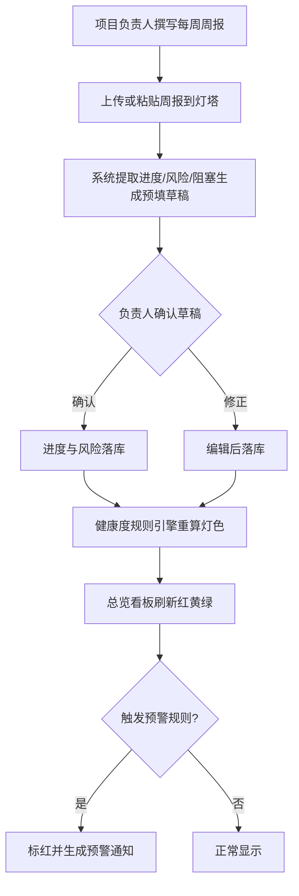
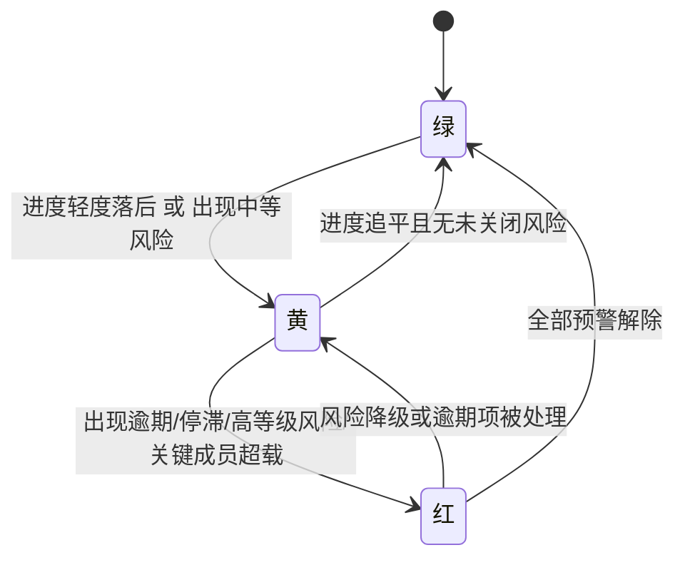
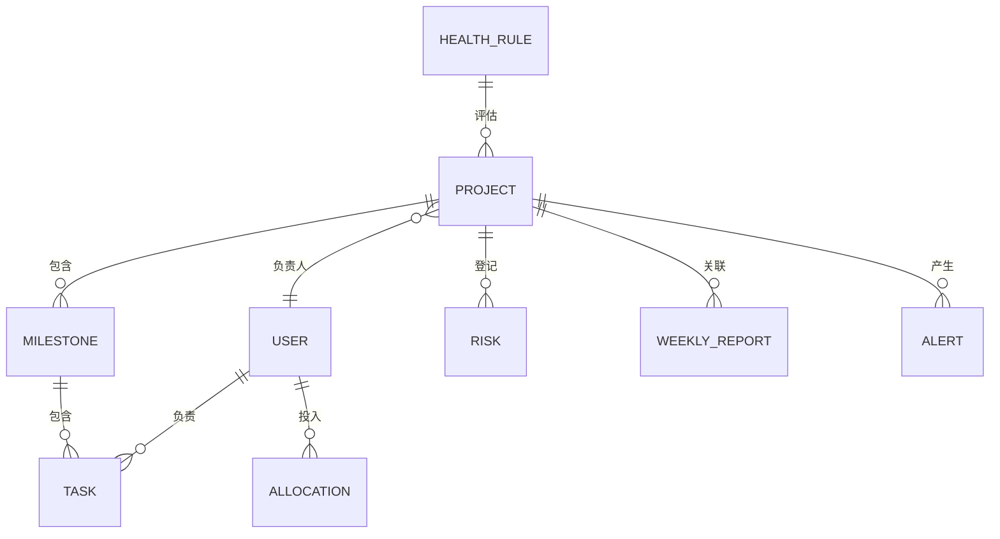

# 项目灯塔 PRD

## 0. 阶段路线图与 MVP 定义

| 阶段 | 验证目标 | 功能模块 | 交付物 |
|---|---|---|---|
| 阶段一（MVP） | 管理层能否在一屏看清 30 个项目的红黄绿健康度；数据能否靠"周报提取+极简手填"维持基本新鲜 | 多项目总览看板、项目进度、风险登记与预警、人力负载、周报提取、三角色权限、内网账号 | 可在公司内网部署运行的 Web 应用 + 手机查看页 |
| 阶段二 | 数据新鲜度能否进一步自动化、协作能否打通现有工具 | Git/任务流集成、钉钉/飞书 SSO 与消息推送、完整甘特、报表导出 | 集成版 |
| 阶段三 | 是否扩展到跨项目复盘与成本视角 | 跨项目复盘报表、工时成本核算、外部干系人只读视图 | 增强版 |

**MVP 完成定义**：完成 FR-1、FR-2、FR-3、FR-4、FR-5、FR-6、FR-7 即 MVP 完成——管理层登录后在一个看板上按健康度排序看清全部在跑项目的红/黄/绿状态，点进任一项目可见其进度、风险、人力投入，且系统能从上传的周报中提取信息预填、对逾期/停滞/超载自动标红。

---

## 1. 项目背景与收益

### 1.1 需求简介（一句话）

面向研发团队的轻量多项目统管工具：让管理层在一个看板上看清所有在跑项目的进度、风险与人力负载，把分散在表格和群聊里的项目状态收敛成一处可信视图。

### 1.2 收益预估（价值论证）

> 这套工具替公司挽回的是"多项目协调不畅"的持续损耗——钱花在三处：管理层反复开会问进度、风险事后才发现导致返工、人力错配（有人排爆有人空转）。

测算口径（数字均由企业方拍板，非估算填充）：

```text
年损耗 ≈ 研发人数 × 人均年综合成本 × 协调损耗比例
       = 150 人   ×   30 万元/人     ×   5%
       ≈ 225 万元/年
```

- 研发人数 150、人均年综合成本 30 万元、协调损耗比例 5%：三个值均由企业方确认（来源：阶段 2 价值论证，企业方拍板）。
- 损耗比例区间参考：项目管理不善通常消耗项目资源约 5%~12%（来源：行业经验区间，本 PRD 取最保守的 5%）。
- 对比锚点：同类商业产品授权费约 99 元/人/年起（来源：[PingCode 私有部署](https://docs.pingcode.com/blog/tool/67424.html)），150 人量级仅授权费即约 1.5 万元/年起，私有部署买断更高。

收益判断：灯塔只要把上述 225 万元/年损耗挽回其中一部分，一年内即可覆盖自研投入。自研相对采购商业产品的真实优势在于贴合内网部署、无持续人/年订阅费、数据自主、流程可按团队习惯定制——而非单纯比商业产品便宜（自研需计入持续维护人力）。

---

## 2. 用户画像

### 2.1 角色与权限矩阵

| 角色 | 是谁 | 核心诉求 | 总览看板 | 项目详情 | 录入/编辑 | 风险 | 人力负载 | 系统设置 |
|---|---|---|---|---|---|---|---|---|
| 管理层 / PMO | 同时盯多个项目的负责人、老板 | 一眼看清全局健康度 | 全部项目 | 只读全部 | 否 | 只读全部 | 全部人 | 是（健康度规则、账号） |
| 项目负责人 / PM | 单个或几个项目的负责人 | 管好自己项目、排人、控风险 | 自己负责的项目 | 读写自己项目 | 是（自己项目） | 读写自己项目 | 自己项目成员 | 否 |
| 研发成员 | 一线研发 | 极简更新自己任务进度 | 自己参与的项目 | 读自己参与项目 | 是（自己任务进度） | 提报风险 | 只读自己 | 否 |

### 2.2 明确不是谁

- 不是给非研发的纯职能团队（财务、行政）做通用任务管理。
- 不是对外售卖给其他公司的 SaaS（单组织内部使用，不做多租户隔离）。
- 不是替代研发的需求/缺陷/测试工作流工具——灯塔不做这些细粒度工作流。

### 2.3 用户故事

- **US-1**：作为管理层，我希望打开一个看板就按健康度排序看到所有在跑项目的红黄绿状态，这样我不用逐个群里问进度（→ FR-1、FR-6）。
- **US-2**：作为管理层，我希望一眼看到"哪些项目长时间没人更新"，这样我能定向施压督促（→ FR-1、FR-4）。
- **US-3**：作为项目负责人，我希望把每周已有的项目周报上传后系统自动提取进度和风险预填，我只需确认修正，这样更新成本极低（→ FR-3、FR-2、FR-4）。
- **US-4**：作为项目负责人，我希望维护项目里程碑和任务并自动算出完成百分比，这样进度有据可依（→ FR-2）。
- **US-5**：作为项目负责人，我希望登记项目风险并标注等级和应对状态，同时系统对逾期/停滞自动标红，这样风险不靠人记（→ FR-4）。
- **US-6**：作为项目负责人，我希望排人前先看每个人手上压了几个项目、是否超载，这样减少资源冲突（→ FR-5）。
- **US-7**：作为研发成员，我希望在三次点击内更新自己任务的进度，这样我愿意持续更新（→ FR-2）。
- **US-8**：作为研发成员，我希望在手机上随手查看自己项目进度和收到的预警，这样不必开电脑（→ FR-8）。
- **US-9**：作为管理层，我希望自定义"什么算红"的阈值，这样健康度判定贴合我们团队（→ FR-6）。

---

## 3. 功能需求

### 3.1 功能清单

| 编号 | 功能 | 所属阶段 | 优先级 | 对应用户故事 |
|---|---|---|---|---|
| FR-1 | 多项目总览看板 | 阶段一 | P0 | US-1、US-2 |
| FR-2 | 项目进度管理（里程碑+任务%+时间线） | 阶段一 | P0 | US-4、US-7 |
| FR-3 | 周报智能提取 | 阶段一 | P0 | US-3 |
| FR-4 | 风险登记与自动预警 | 阶段一 | P0 | US-5、US-2 |
| FR-5 | 人力负载视图 | 阶段一 | P0 | US-6 |
| FR-6 | 健康度规则引擎（预设+阈值可调） | 阶段一 | P0 | US-1、US-9 |
| FR-7 | 角色权限与内网账号 | 阶段一 | P0 | 全部 |
| FR-8 | 预警通知与手机查看 | 阶段一 | P1 | US-8 |
| FR-9 | Git/任务流集成自动取进度 | 阶段二 | P2 | US-3 |
| FR-10 | 钉钉/飞书 SSO 与消息推送 | 阶段二 | P2 | US-8 |
| FR-11 | 完整甘特图 | 阶段二 | P2 | US-4 |
| FR-12 | 报表导出 | 阶段二 | P2 | US-1 |

### 3.2 详细功能说明

**FR-1 多项目总览看板**
管理层登录后默认进入的核心页面，以卡片或行的形式陈列所有在跑项目，每个项目显示名称、负责人、整体进度百分比、健康度灯（红/黄/绿）、最近更新时间、未关闭风险数。看板默认按健康度排序（红色置顶），支持按负责人、健康度、最近更新时间筛选与排序。对"超过设定天数无人更新"的项目显式标注空白徽标，使"谁没更新"一眼可见，形成督促压力。这是全产品的第一性体验，要求 30 个项目在一屏内可扫读、不需要横向滚动即可判断整体盘面。

**FR-2 项目进度管理**
每个项目由若干里程碑构成，里程碑下挂任务。任务有"未开始/进行中/已完成"状态，成员在三次点击内即可切换任务状态。项目整体进度百分比由已完成任务数占比自动计算，里程碑进度同理汇总。项目详情页提供一条计划对实际的轻量时间线（里程碑计划时间与实际完成时间对照），让拖期一眼可见。完整甘特图放在阶段二，MVP 仅做里程碑级时间线以控制开发成本。进度数据来源以成员手填与周报提取为主。

**FR-3 周报智能提取**
项目负责人将每周已有的项目周报以粘贴文本或上传文件的方式喂入系统，系统按规则与语义识别提取其中的进度描述、新增风险、阻塞点，生成一份预填草稿映射到对应项目的进度与风险字段。负责人在草稿上确认或修正后落库。此功能把更新动作从"对着空表格填写"转变为"把已有周报贴进来再确认"，是降低录入负担、对抗"没人愿意填"的核心手段。周报现存形态（钉钉/文档/邮件）在阶段一默认以文本上传方式接入，不依赖外部系统。

**FR-4 风险登记与自动预警**
项目负责人可在项目下登记风险条目，每条含描述、等级（高/中/低）、责任人、应对状态（待处理/处理中/已关闭）。同时系统按规则自动生成预警：任务逾期、项目超过设定天数无更新（停滞）、某成员人力投入超过阈值（超载），自动在项目与总览看板标红并进入预警列表。人工登记与自动预警双轨并存，确保风险既有人主动记录、也有系统兜底发现。

**FR-5 人力负载视图**
以人为单位展示每个研发成员当前参与的项目数、任务数，以及由项目负责人粗估的投入占比之和。当某人投入占比合计超过设定上限即标记为超载。视图支持按团队或项目维度查看，帮助负责人在排人前判断谁有余量、谁已排爆。MVP 不要求成员逐日填报精确工时，投入占比由负责人粗粒度估给，避免引入又一项无人维护的录入负担。

**FR-6 健康度规则引擎**
系统内置一组预设健康度判定规则，例如：进度落后计划超过阈值、存在逾期任务、存在高等级未关闭风险、项目停滞超过设定天数、关键成员超载。每条规则可由管理层调整阈值或启用停用。规则综合判定项目健康度灯色（红/黄/绿）。MVP 采用预设规则加阈值可调的形式，不做用户自定义规则表达式，以控制复杂度。

**FR-7 角色权限与内网账号**
系统自建账号体系，部署在公司内网或私有服务器。三种角色（管理层、项目负责人、研发成员）按第 2.1 节权限矩阵控制可见数据与可执行操作。管理层可创建账号、分配角色、归属项目。阶段一不接入企业 SSO（放阶段二）。所有关键操作（创建/删除项目、修改健康度规则、变更成员归属）记录操作审计日志。

**FR-8 预警通知与手机查看**
预警产生时在站内生成通知，相关角色登录后可见未读预警。提供手机浏览器可访问的轻量查看页，覆盖看进度、收预警、查看自己任务三个只读场景，不在手机端做完整录入。阶段二再接入钉钉/飞书消息推送。

**FR-9 ~ FR-12**（阶段二/三，此处仅列范围不展开）：Git/任务流集成自动取进度、钉钉飞书 SSO 与推送、完整甘特、报表导出。

---

## 4. 流程与状态图表

### 4.1 核心用户旅程（周报驱动的进度更新）



### 4.2 关键状态机（项目健康度灯色）



---

## 5. 边界与异常场景

### 5.1 数据边界
- 单组织规模上限按 200 人、50 个并行项目设计（当前 150 人/30 项目，留冗余），常规单体架构与关系型数据库即可支撑，无需大数据架构。
- 周报提取失败（格式无法识别）时，回退为空白草稿让负责人手填，不阻塞流程。
- 历史项目归档后从总览看板默认隐藏，可在归档视图查看。

### 5.2 并发与冲突
- 同一项目多人同时编辑不同任务互不冲突；编辑同一任务以最后提交为准并保留修改记录。
- 健康度规则变更后对全部项目异步重算，重算期间看板显示上一次结果。

### 5.3 第三方依赖失败
- 阶段一为独立部署，无强外部依赖；周报提取若使用本地语义模型，模型不可用时退回关键词规则提取。
- 手机查看页依赖内网可达；不可达时提示用户切换至内网环境。

### 5.4 极端情况
- 极端情况：单个项目任务数异常膨胀（如超过数千条）时，项目详情分页加载，总览看板仍只展示汇总灯色不受影响。
- 极端情况：同一周对一个项目重复上传多份周报时，以最新一份的确认结果为准，历史周报保留可查。

---

## 6. 数据模型

### 6.1 实体关系



### 6.2 核心实体字段（字段含义级，不含数据库类型）

| 实体 | 字段 |
|---|---|
| 用户 User | 姓名、账号、角色（管理层/负责人/成员）、所属团队 |
| 项目 Project | 名称、负责人、状态（在跑/归档）、整体进度、健康度灯色、最近更新时间 |
| 里程碑 Milestone | 所属项目、名称、计划完成时间、实际完成时间、进度 |
| 任务 Task | 所属里程碑、负责人、状态（未开始/进行中/已完成）、计划时间 |
| 风险 Risk | 所属项目、描述、等级（高/中/低）、责任人、应对状态、来源（人工/周报提取/自动） |
| 周报 WeeklyReport | 所属项目、周次、原文、提取草稿、确认状态 |
| 人力投入 Allocation | 用户、项目、投入占比（粗估）、生效周期 |
| 预警 Alert | 所属项目、类型（逾期/停滞/超载/高风险）、触发时间、状态（未读/已读/已解除） |
| 健康度规则 HealthRule | 规则类型、阈值、是否启用 |
| 审计日志 AuditLog | 操作人、操作类型、对象、时间 |

### 6.3 数据治理
- 时区：全系统统一存储与展示使用公司所在时区（默认东八区），周报周次按自然周计。
- PII：成员姓名、账号属公司内部数据，仅在内网范围流转，不出公司、不对外同步。
- 一致性：进度百分比为派生字段，由任务状态实时计算，不允许手工覆盖以避免与任务数据不一致；健康度灯色为派生字段，由规则引擎统一重算。
- 保留：归档项目数据长期保留可查，审计日志不可删除。

---

## 7. 技术方案建议

> 企业方已确认按通用最佳实践由本 PRD 推荐技术栈（非对齐现有栈）。以下为建议，最终细案由设计阶段定。

- **形态与端**：Web 为主（响应式，桌面优先），手机端做只读查看页，同一套前端按角色与屏幕显隐模块，阶段一不做独立 App。
- **架构**：单体应用 + 关系型数据库，前后端分离。当前规模无需微服务或分布式。
- **模块边界**：
  - 看板与项目模块（FR-1、FR-2）
  - 周报提取模块（FR-3，可插拔的提取引擎：规则 + 可选本地语义模型）
  - 风险与预警模块（FR-4，含定时巡检任务）
  - 人力负载模块（FR-5）
  - 健康度规则引擎（FR-6，被预警与看板调用）
  - 账号与权限模块（FR-7，含审计）
- **部署**：公司内网/私有服务器，容器化部署，数据不出公司。
- **健康度与预警**：以定时巡检 + 事件触发两种方式重算，结果缓存供看板快速读取。
- **核心算法库**：周报提取建议采用本地可部署的中文分词/语义模型或 NLP 算法库（规则提取兜底），保证数据不出内网；不引入需联网的外部大模型 API，以符合内网部署约束。

---

## 8. 成功度量

### 8.1 北极星指标
- 管理层打开总览看板到掌握全局健康度所需时间 ≤ 1 分钟（来源：阶段 2 与企业方确认的成功定义）。

### 8.2 关键指标矩阵

| 目标（Goal） | 指标（Metric） | 口径 |
|---|---|---|
| 全局透明（业务目标） | 在跑项目中健康度数据"新鲜"（最近 7 天有更新）的占比 ≥ 80% | 周度统计 |
| 降低录入负担（用户目标） | 单次进度更新点击数 ≤ 3 | 埋点统计 |
| 风险前置（业务目标） | 风险/逾期由系统自动预警发现的占比 ≥ 60% | 月度统计 |
| 人力可视（用户目标） | 排人前查看人力负载视图的负责人占比 ≥ 70% | 月度统计 |

### 8.3 反向指标
- 周报提取后被负责人大幅修正（修正字段占比 > 50%）的周报比例，用于监控提取质量；过高说明提取不可用需调整。

---

## 9. 风险与依赖

### 9.1 头号风险：全员协作模式下数据无人维护（A-002）
- 失败模式：成员不愿持续更新任务进度，数据滞后失真，总览看板失去可信度，整个产品价值归零。
- 缓解（第一性设计，非附加）：① 单次更新 ≤ 3 次点击；② 看板暴露"谁/哪个项目没更新"形成督促；③ 周报提取把录入变为"贴+确认"；④ 逾期/停滞自动预警兜底。
- 验证方式：上线后以"健康度数据新鲜占比 ≥ 80%"（见 8.2）作为存亡指标，先选 2-3 个样板项目验证再全员铺开。

### 9.2 范围蔓延滑向重型平台
- 失败模式：负责人不断要求加需求池/缺陷流/测试用例，灯塔逐步变成 ONES 的劣化复制，丧失"轻"的唯一优势。
- 缓解：在产品定义层面写死边界（见 2.2），任务仅作进度载体；新增功能须先论证不破坏"一屏看清全局"的第一性体验。

### 9.3 健康度判定规则不被认可
- 失败模式：系统判红的项目负责人不认可，导致灯色被忽视。
- 缓解：健康度规则阈值可由管理层调整（FR-6），先用预设规则跑样板项目校准。

### 9.4 外部依赖
- 阶段一无强外部依赖；阶段二的钉钉/飞书/Git 集成依赖对方接口稳定性，届时单独评估。

---

## 10. 验收标准

### 10.1 主流程
- AC-1：管理层登录后默认进入总览看板，看到全部在跑项目按健康度排序、红色置顶，单屏可扫读 30 个项目。
- AC-2：负责人上传一份周报后，系统在草稿中提取出进度与风险，确认后总览看板对应项目状态更新。
- AC-3：成员在三次点击内将一个任务从"进行中"切换为"已完成"，项目进度百分比相应自动更新。
- AC-4：某项目超过设定停滞天数无更新时，总览看板对该项目显示空白徽标，并出现停滞预警。

### 10.2 异常分支
- AC-5：上传无法识别格式的周报，系统回退空白草稿并提示手填，不报错中断。
- AC-6：编辑同一任务发生并发提交，以最后提交为准并可见修改记录。
- AC-7：周报提取引擎不可用时，回退关键词规则提取或空白草稿，流程不阻塞。

### 10.3 权限与角色
- AC-8：研发成员无法看到非自己参与项目的详情；项目负责人无法修改健康度规则；仅管理层可创建账号与改规则。

### 10.4 兼容性
- AC-9：主流桌面浏览器正常使用全部功能；手机浏览器可访问只读查看页（进度/预警/我的任务）。

### 10.5 回归影响
- AC-10：健康度规则阈值变更后，全部项目灯色按新规则重算且不丢历史；新增项目不影响既有项目看板表现。

---

## 11. 依据清单

### 11.1 用户依据
- 企业方为 150 人研发团队、约 30 个并行项目，现以表格加群聊管理，全局不透明（来源：阶段 0-1 访谈）。
- 全员协作、人人更新自己任务；进度数据可从已有项目周报提取（来源：企业方阶段 1、阶段 4 确认）。
- 内网部署、无特殊合规要求（来源：企业方阶段 1 确认）。

### 11.2 竞品依据
- 禅道被反复指出界面复杂、上手成本高，易导致无人愿意填（来源：[PingCode vs 禅道对比](https://docs.pingcode.com/blog/tool/14195.html)）。
- ONES 已具备项目集、资源负载、工时、仪表盘，但功能叠加多致界面繁琐、对中小团队功能过剩（来源：[ONES 缺点分析](https://ones.com.cn/knowledge/ones-company-analysis-strengths-challenges-wise-choice)、[ONES Plan](https://ones.cn/solutions/plan)）。
- 同类私有部署授权约 99 元/人/年起（来源：[PingCode 私有部署](https://docs.pingcode.com/blog/tool/67424.html)）。

### 11.3 行业 Benchmark
- 项目管理不善通常消耗项目资源约 5%~12%（来源：行业经验区间，本 PRD 取 5%）。
- PMO 实操普遍采用红黄绿三级预警 + 资源负载图（来源：[ONES-PMO 组合管理](https://ones.cn/blog/knowledge/pmo-5-key-challenges-successful-project-portfolio-management)）。

### 11.4 内部假设
- A-002：全员愿意更新自己任务（依据 D，最大风险，靠 9.1 对策与 8.2 指标验证）。
- A-005：项目健康度可由进度偏差+逾期+风险等级+人力超载自动合成（依据 C，规则见 FR-6）。
- A-007：周报阶段一以上传/粘贴文本接入，现存形态（钉钉/Word/邮件）待设计阶段细化（依据 C）。

### 11.5 待决问题（OPEN_QUESTION）
- OQ-2：周报现存于何处、是否需要在阶段二做自动抓取，影响 FR-9 的集成方式，待设计阶段与企业方确认。

---

## 12. 术语表

| 术语 | 含义 |
|---|---|
| 健康度灯色 | 项目整体状态的红/黄/绿信号，由健康度规则引擎综合判定 |
| 停滞 | 项目超过设定天数无任何更新 |
| 超载 | 某成员的人力投入占比合计超过设定上限 |
| 周报提取 | 从上传的项目周报中识别进度/风险/阻塞并预填的能力 |
| 投入占比 | 由项目负责人粗估的某成员在某项目上的精力占比，非精确工时 |
