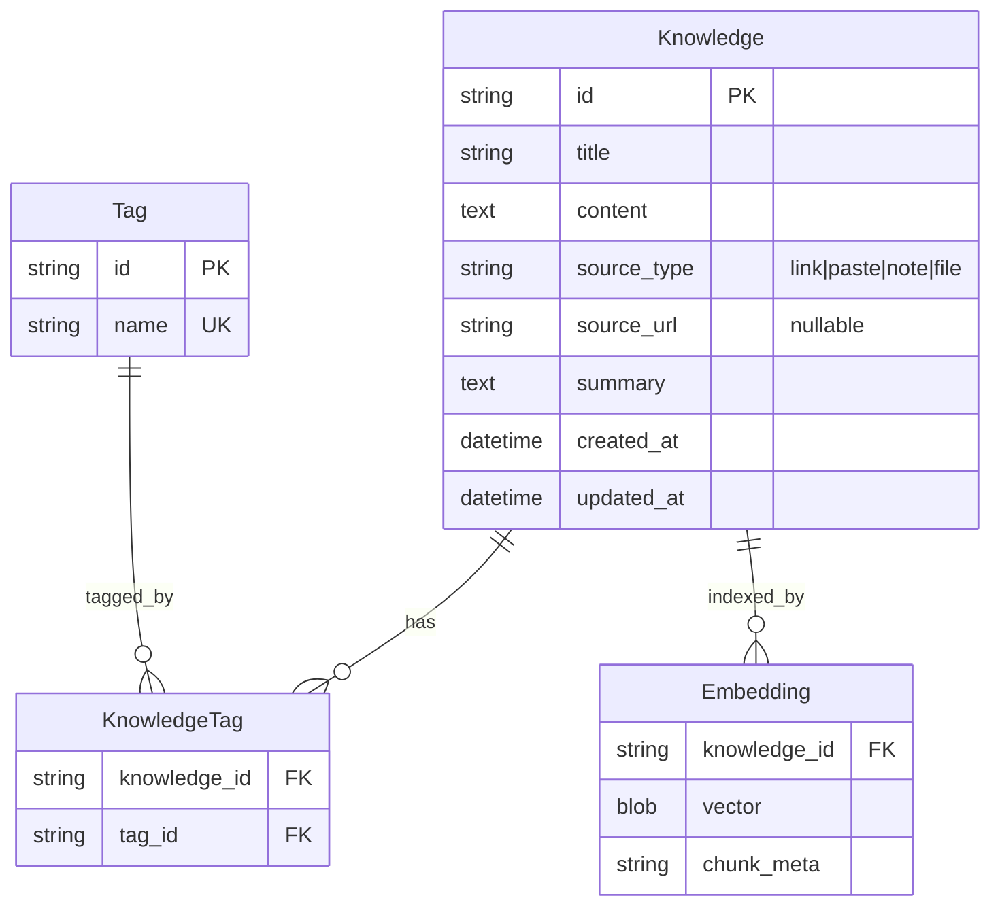
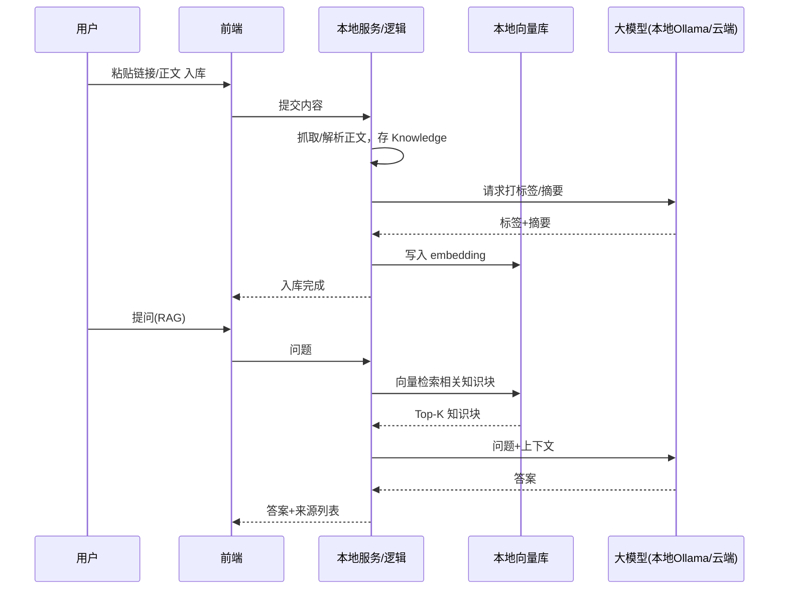

# 项目知识库 PRD

## 0. 阶段路线图与 MVP 定义

本产品是一个**本地优先（local-first）的个人 AI 知识库**。第一版（MVP）面向发起人本人（研发技术场景）自用，终极目标是让销售、管理、研发、工程师等各类岗位的人各自拿去管理自己的知识库。

### 阶段划分

| 阶段 | 验证目标 | 功能模块 | 交付物 |
|---|---|---|---|
| 阶段一 · MVP | 验证"少录入、强找回、能关联、可问答"的核心闭环对个人自用成立 | FR-1 录入 / FR-2 自动整理 / FR-3 语义检索 / FR-4 相关推荐 / FR-5 标签聚合 / FR-6 库内问答(RAG) / FR-7 大模型底座 / FR-8 知识管理 | 本地可运行的电脑网页端应用 |
| 阶段二 · 增强 | 降低录入摩擦、扩展场景 | 浏览器插件一键剪藏、公众号抓取深度优化、关系图谱可视化 | 增强版 |
| 阶段三 · 多人化 | 验证人人可用 | 手机端、多端云同步、多岗位多人各自部署/使用 | 可推广版 |

### MVP 完成定义

> 把一篇微信公众号文章（或一段与 AI 的对话）丢进知识库，系统自动打标签、生成摘要并归类；之后我用大白话就能搜到它、看到与它相关的其他知识，并能基于整个库提问得到带来源的答案。

### MVP 功能清单（带所属阶段）

| 编号 | 功能 | 优先级 | 所属阶段 |
|---|---|---|---|
| FR-1 | 内容录入（贴链接抓正文 / 复制粘贴 / 编辑器写 / 上传文件 PDF·Word·MD） | P0 | 阶段一 |
| FR-2 | 自动整理（自动打标签 + 摘要 + 归类） | P0 | 阶段一 |
| FR-3 | 语义检索（自然语言按意思搜） | P0 | 阶段一 |
| FR-4 | 相关推荐（看某条时列出相关知识） | P0 | 阶段一 |
| FR-5 | 标签聚合（按标签浏览/筛选） | P1 | 阶段一 |
| FR-6 | 库内问答 RAG（基于个人库提问，答案标来源） | P0 | 阶段一 |
| FR-7 | 大模型底座（本地 Ollama 优先 + 云端 API 可选） | P0 | 阶段一 |
| FR-8 | 知识管理（列表 / 详情 / 编辑 / 删除） | P0 | 阶段一 |

## 1. 产品概述与价值论证

### 一句话定位
本地优先的个人 AI 知识库，聚焦中文内容生态（微信公众号、中文文章、中文 AI 对话记录）与开箱即用，把多来源信息沉淀为可语义检索、可关联、可问答的个人知识资产。

### 解决的问题
每天从微信公众号、各类文章、与 AI 的对话、个人心得里获取大量信息，当时觉得有用，过段时间忘了存在哪、想不起来，要用时翻半天找不回甚至重新查。普通收藏夹只能堆、不能"问"、看不出知识之间的联系。

### 价值论证（诚实口径：个人效率工具，不套商业大盘）
- **核心价值**：① 省下找信息的时间（需要时一问就找回）② 知识沉淀复利（碎片信息变成可被 AI 调用、越用越值钱的资产）。
- **量化**：用户确认每天约 30 分钟花在"找看过的资料/重复查"上 → 约 250 工作日/年 ≈ 125 小时/年 ≈ 大半个月工作时间。
- **最锋利一句**：每年从"找不回已看过的东西"里抢回大半个月，把碎片信息攒成越用越值钱的个人知识资产。

### 差异化（甜区）
对标海外开源产品（Reor / Khoj / AnythingLLM 已验证本地优先 AI 知识库技术可行），差异化在于海外产品的中文生态空白：
1. 微信公众号文章抓取（海外无）
2. 中文 AI 对话记录导入（海外无）
3. 中文语义检索效果
4. 开箱即用（不需用户自行折腾 Ollama 配置）
5. 数据与代码完全自有、可定制

### 防跑偏红线
不做成又一个团队文档协作平台 / Wiki。它是**个人的、本地的、AI 驱动的**，重心在"少录入、强找回、能关联"，不是多人编辑和审批流。

## 2. 目标用户与使用场景

### 用户
- 第一版主用户：发起人本人，研发技术岗，日均接触大量技术信息。
- 终极用户：销售 / 管理 / 研发 / 工程师等各岗位个人，各自管理自己的知识库。
- 不是谁：不是公司统一文档中心，不是团队内容共享平台，不是多租户 SaaS。

### 典型场景
1. **随手沉淀**：刷到一篇好的技术公众号文章，复制链接粘进知识库，系统自动抓正文、打标签、生成摘要。
2. **沉淀 AI 对话**：和 AI 讨论出有价值的结论，复制对话粘进来留存。
3. **写心得**：临时有想法，在工具内编辑器直接写一条。
4. **找回**：两周后想起"之前看过一篇讲缓存策略的"，用大白话一搜就找到，旁边还列出相关的几条。
5. **问答**：直接问"我之前整理的关于 X 的要点有哪些"，AI 从库里找答案并标明来源。

## 3. 功能需求

### FR-1 内容录入（P0）
支持四种入库方式：
- **贴链接抓正文**：粘贴公众号/网页链接，系统抓取并解析正文入库。抓取失败时自动提示并回退到"粘贴正文"。
- **复制粘贴文本**：直接粘贴正文或 AI 对话记录。
- **编辑器写**：内置 Markdown 编辑器，随手写个人心得。
- **上传文件**：上传 PDF / Word / Markdown，解析文本入库；支持一次多选批量上传，逐个解析并汇总成功/失败结果。
- 验收：四种方式均能成功把内容存为一条知识，并触发 FR-2 自动整理。

### FR-2 自动整理（P0）
内容入库后，调用大模型自动：打标签、生成摘要、归类。
- 验收：每条新知识入库后自动生成 ≥1 个标签和一段摘要；用户可手动修改标签/摘要。

### FR-3 语义检索（P0）
用自然语言按语义搜索，而非仅关键词匹配。基于本地 embedding + 向量检索。
- **展示形态**：在电脑网页端以**结果列表**呈现，每条为一张卡片，含：标题、命中摘要片段、标签、来源类型、相关度；点击任意一条进入知识详情页（正文 + 摘要 + 标签 + 相关推荐）。
- 验收：输入一句口语化描述，能返回语义相关的知识，相关项排在前。

### FR-4 相关推荐（P0）
查看某条知识时，自动列出语义相关的其他知识。
- 验收：知识详情页展示 ≥3 条相关知识（库内容足够时）。

### FR-5 标签聚合（P1）
按标签浏览、筛选知识；同标签知识聚合展示。
- 验收：点击某标签，列出该标签下所有知识。

### FR-6 库内问答 RAG（P0）
基于个人知识库提问，AI 检索相关知识后生成答案，并标注答案来源（引用了哪几条知识）。
- **展示形态**：在电脑网页端以**问答形式**呈现——直接展示答案文本，下方挂可点击跳转原文的来源知识列表（区别于 FR-3 的列表卡片）。
- 验收：提问后返回答案，且附可点击跳转的来源知识列表。

### FR-7 大模型底座（P0）
- 本地大模型优先（Ollama），用户可配置；公开大模型（云端 API）可选，可配置 API Key 切换。云端走 OpenAI 兼容接口，内置服务商预设（Google AI Studio/Gemini、DeepSeek、通义、智谱），亦可自定义任意兼容端点。
- embedding 用本地中文友好的轻量模型。
- 验收：在仅本地大模型可用时，FR-2/FR-3/FR-6 均可正常工作；切换云端 API 后同样可用。

### FR-8 知识管理（P0）
知识的列表、详情、编辑、删除。
- 验收：增删改查均生效，且编辑内容后重新触发 embedding 更新。

## 4. 信息架构与页面

```text
应用
├── 首页/知识列表        （FR-8 列表 + FR-3 搜索框入口）
├── 检索结果页          （FR-3 列表卡片：标题/命中片段/标签/来源/相关度）
├── 录入页/快捷录入      （FR-1 四种方式）
├── 知识详情页          （正文/摘要/标签 + FR-4 相关推荐）
├── 标签浏览页          （FR-5 标签聚合）
├── 问答页              （FR-6 答案 + 可点击来源列表）
└── 设置页              （FR-7 大模型配置：本地/云端、API Key）
```

## 5. 数据模型（MVP）



**实体字段说明**：

| 实体 | 字段 | 说明 |
|---|---|---|
| Knowledge | id | 知识唯一标识（主键） |
| Knowledge | title | 标题 |
| Knowledge | content | 正文 |
| Knowledge | source_type | 来源类型：link / paste / note / file |
| Knowledge | source_url | 来源链接（可空） |
| Knowledge | summary | 大模型生成的摘要 |
| Knowledge | created_at / updated_at | 创建 / 更新时间 |
| Tag | id | 标签标识（主键） |
| Tag | name | 标签名（唯一） |
| KnowledgeTag | knowledge_id / tag_id | 知识↔标签 多对多关联（外键） |
| Embedding | knowledge_id | 所属知识（外键） |
| Embedding | vector | 向量 |
| Embedding | chunk_meta | 分块信息 |

### 数据治理
- **存储位置**：全部存储于本地（本地数据库文件 + 本地向量库），不强制上云。
- **时区**：时间戳统一用本地时区存储，展示按本地时间。
- **隐私(PII)**：知识内容可能含个人/工作敏感信息；默认不出本机，使用云端大模型时仅发送必要上下文并提示用户。
- **一致性**：正文更新后必须同步重建对应 Embedding，保证检索与正文一致；删除知识级联删除其标签关联与向量。
- **备份**：本地数据可一键导出备份。

## 6. 技术架构（local-first，建议栈，可由 AI 编码助手按实际调整）

- **形态**：本地运行——推荐桌面壳 **Tauri**（轻、Rust 内核）或 **Electron**；亦可本地服务 + 浏览器访问 localhost。第一版电脑端。
- **前端框架**：**React + TypeScript**（生态成熟、AI 编码助手友好），UI 库如 shadcn/Tailwind。
- **后端/逻辑**：随形态而定——Tauri 用 **Rust**；若本地服务方案用 **Python(FastAPI)** 或 **Node.js**，便于接 AI 生态。
- **大模型/embedding**：本地 **Ollama** 优先；云端 OpenAI/Claude 兼容 API 可选。embedding 用本地中文友好轻量模型（bge-small-zh 类）。
- **核心算法库**：向量检索 + RAG 编排（可用 LlamaIndex / LangChain 或自研轻量 RAG）。
- **向量库**：嵌入式本地向量库 **LanceDB / Chroma**，无需独立服务。
- **结构化存储**：**SQLite**（本地文件）。
- **正文抓取**：通用网页正文解析（Readability 类）+ 微信公众号适配。
- **部署/基础设施**：本地单机部署，无服务器；打包为桌面安装包或一键启动脚本。
- 数据全在本机。技术栈最终由 AI 编码助手按 local-first 最佳实践确定。

## 7. 核心流程

```text
录入流程：
选择录入方式 → 获取内容(抓取/粘贴/编辑/上传) → 存为知识
   → 异步：生成 embedding + 大模型打标签/摘要/归类 → 入库完成

检索流程：
输入自然语言 → 计算 query embedding → 向量检索 + 标签/关键词辅助
   → 返回排序结果

问答流程(RAG)：
输入问题 → 检索相关知识块 → 拼装上下文 → 大模型生成答案 + 标注来源
```

### 录入与问答时序图



## 8. 非功能需求

- **隐私**：数据默认全本地，不上传；使用云端大模型时仅发送必要上下文，并明确提示用户。
- **性能**：几千条规模下，语义检索响应应在秒级；本地大模型性能依赖用户机器，提供云端兜底。
- **可用性**：开箱即用，大模型未配置时给清晰引导；录入操作尽量一步完成。
- **数据安全**：本地数据可导出备份。

## 9. 开放问题与假设

### 9.1 开放问题（待技术验证或后续拍板）
- OQ-1：微信公众号正文抓取的反爬可行性与稳定性，需技术验证。
- OQ-2：本地大模型在普通个人电脑上的性能与中文效果是否达标，需实测。
- OQ-3：embedding 模型选型（本地中文模型 vs 云端），影响检索效果与性能。

### 9.2 假设清单
- A-001：微信公众号链接可被抓取正文（等级 C，需验证；失败回退粘贴正文）。
- A-002：普通个人电脑可跑动本地大模型完成语义检索/RAG 且效果可接受（等级 C，需验证；云端兜底）。
- A-003：录入足够轻，用户才会持续用（等级 B，成败关键）。
- A-004：几千条规模下本地向量检索性能足够（等级 B）。
- A-005：第一版自用即可验证价值，多人版需求成立但暂不验证（等级 B）。

## 10. 验收标准（MVP 完成定义）

MVP 视为完成，当且仅当以下验收标准全部通过：

| 编号 | 关联功能 | 优先级 | 验收点 | 测试数据 / 预期 |
|---|---|---|---|---|
| AC-1 | FR-1 | P0 | 四种方式均能成功入库；公众号抓取失败回退粘贴 | 粘贴公众号链接「Redis 缓存穿透解决方案」→ 抓取标题+正文入库；故意贴失效链接 → 提示并切到粘贴框 |
| AC-2 | FR-2 | P0 | 入库后自动生成 ≥1 标签 + 摘要，可手改 | 录入一篇讲「分布式锁」的文章 → 自动打标签「分布式」「Redis」+ 一段摘要；手动加标签「面试」成功 |
| AC-3 | FR-3 | P0 | 自然语言语义检索，相关项靠前 | 搜「上次那篇讲缓存击穿的」→ 命中标题含「缓存穿透/击穿」的知识并排首位 |
| AC-4 | FR-4 | P0 | 详情页展示 ≥3 条相关推荐 | 打开「Redis 缓存穿透」知识 → 相关推荐列出「布隆过滤器」「缓存雪崩」等 ≥3 条 |
| AC-5 | FR-5 | P1 | 点标签聚合浏览该标签全部知识 | 点标签「Redis」→ 列出该标签下全部知识条目 |
| AC-6 | FR-6 | P0 | 基于库提问返回答案 + 可点击来源 | 问「我整理过哪些缓存相关的方案」→ 返回总结 + 来源知识列表，点击可跳转原文 |
| AC-7 | FR-7 | P0 | 仅本地大模型时核心 AI 功能可用，切云端同样可用 | 关闭网络、仅 Ollama 在线 → AC-2/AC-3/AC-6 正常；配置云端 API Key 切换 → 同样正常 |
| AC-8 | FR-8 | P0 | 数据全本地，可一键导出备份 | 检查数据文件在本机；点「导出备份」→ 生成可恢复的备份文件 |

## 11. 边界与异常处理

- **数据边界**：空内容入库需拦截并提示；超大文件/超长正文需分块处理或限制大小并提示；异常编码/乱码内容需容错。
- **并发冲突**：同一条知识在编辑中被重复保存时，以最后写入为准并保证 embedding 与正文最终一致；入库的异步整理任务需幂等，避免重复打标签。
- **第三方依赖失败**：① 公众号/网页抓取失败 → 回退粘贴正文并提示；② 本地大模型(Ollama)未启动/不可用 → 提示并允许切换云端；③ 云端 API Key 失效/超时 → 明确报错，不静默吞错。
- **平台/设备差异**：不同操作系统（Mac/Windows/Linux）本地大模型可用性不同，设置页需检测并引导；低配设备性能不足时提示改用云端。
- **极端情况**：知识库为空时检索/问答/相关推荐需给空态引导；向量索引损坏需支持重建。
