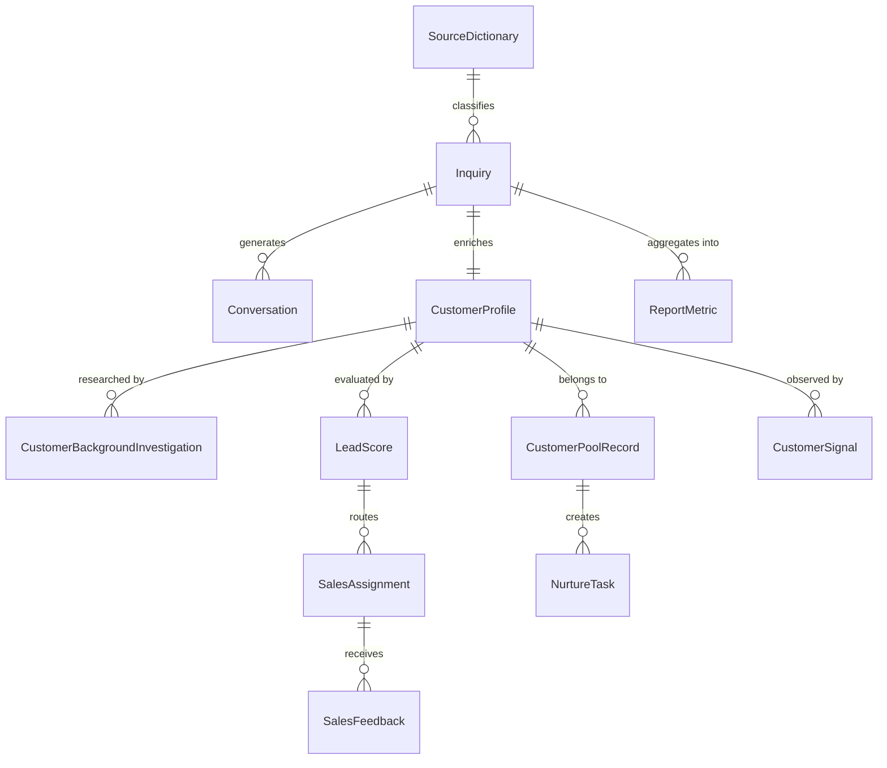
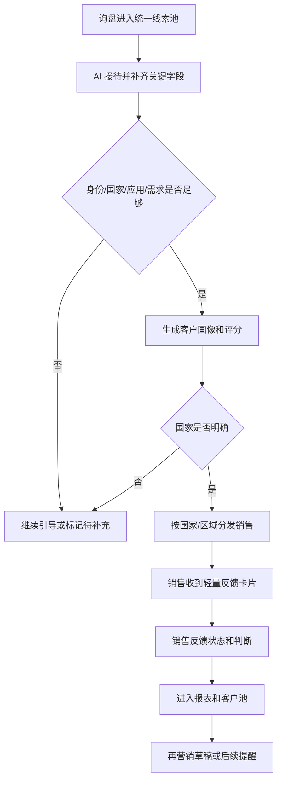
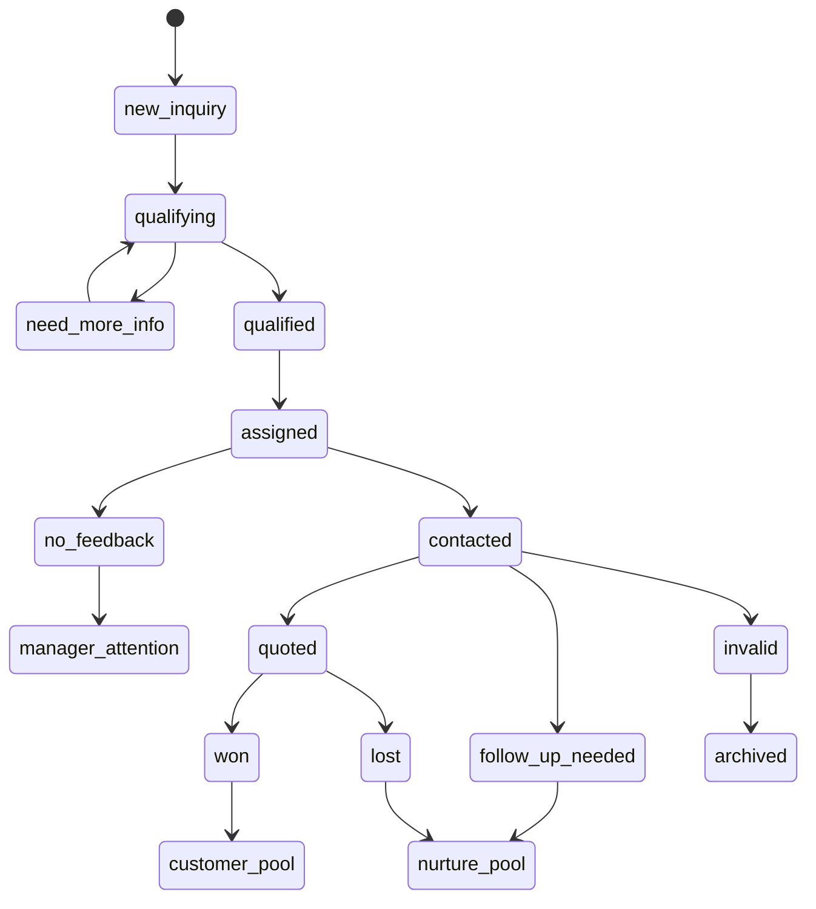
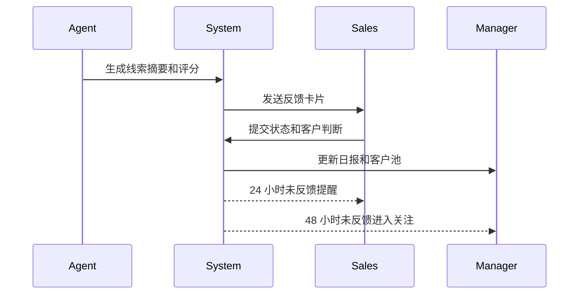

# 智能销售接待与客户洞察 Agent PRD
## 0. 阶段路线图与 MVP 定义

### 0.1 阶段划分

| 阶段 | 验证目标 | 功能模块 | 交付物 |
|---|---|---|---|
| 阶段一 MVP | 跑通“询盘进入、AI 问清、销售收到、销售反馈、管理者看报表、管理员可配置”的最短闭环 | FR-1、FR-2、FR-3、FR-4、FR-5、FR-6、FR-7、FR-8、FR-9、FR-12 | 可用的统一线索池、AI 接待、客户画像评分、国家分发、轻量反馈、基础报表、设置管理 |
| 阶段二 增强 | 提高渠道覆盖和客户经营能力 | FR-10、FR-11 | 再营销草稿队列、客户态势信号记录、更多渠道接入 |
| 阶段三 扩展 | 在数据闭环稳定后连接更复杂系统 | 后续扩展模块 | CRM 深度集成、企业微信深度集成、完整客户态势监督 |

> MVP 完成定义：完成 FR-1 至 FR-9 以及 FR-12 后，第一版 MVP 即视为完成。MVP 必须让官网聊天、官网后台、邮箱、展会名片导入的询盘进入统一线索池，并完成 AI 接待引导、客户画像评分、国家分发、销售轻反馈、基础报表和管理员设置管理。

### 0.2 MVP 必须做

- 统一线索池：官网聊天、官网后台、邮箱、展会名片导入。
- AI 接待与 ultrasound 引导提问。
- 代理商/医生双客群画像。
- 客户背景调查、背景摘要和线索评分。
- 国家/区域销售分发。
- 轻量销售反馈卡片。
- 未反馈提醒。
- 非金额型基础报表。
- 客户池基础分层。
- 设置管理：销售账号、角色权限、全局顶部 Banner、国家销售映射、产品知识库、渠道和提醒规则入口。

### 0.3 MVP 轻量做

- 再营销草稿：由大模型结合客户摘要、客户背景调查、销售反馈、建议下一步动作、人工补充提示词和上传附件素材生成，人工确认后发送。
- 客户态势信号记录：先记录官网公开信息、邮件互动、销售反馈里的机会信号。

### 0.4 明确后置

- 完整 CRM。
- 成交金额、报价金额、业绩金额分析。
- 全渠道自动接入。
- Facebook/LinkedIn 自动抓取或深度态势监测。
- 自动群发再营销。
- 企业微信或 CRM 深度集成。
- 商业数据源集成。

### 0.5 2026-07-01 统一返修范围

本次返修将 14 组用户反馈升格为当前需求真相源，所有页面、接口和测试以本节为准：

1. **设置管理必须可理解、可进入、可操作**：设置首页不再一次性堆叠展示全部配置，也不只展示“销售账号 / 已启用 / 来源国家映射 / 全局 Banner”等难理解指标；页面顶部必须提供设置菜单栏，按菜单切换展示对应设置或配置入口。原 8 个设置入口必须真实可点击并有页面或可操作区，覆盖销售账号、角色权限、全局 Banner、国家销售映射、产品知识库、客户来源字典、渠道配置、提醒规则；新增“大模型选择”配置，用于维护 Claude、Codex、DeepSeek 等可选模型，并分别绑定 AI 接待、邮件草稿和客户背景调研使用的模型；“最近变更”改为“配置审计记录”，只展示配置相关变更，避免像无用消息流。
2. **Banner 展示和管理解耦**：后台和反馈页继续展示全局 Banner，但 Banner 展示区要更宽、更舒展；普通 Banner 展示区只显示图片、标题和正文，不显示“全局公告”“查看详情”“管理 Banner”等管理或跳转字样；Banner 管理只允许在设置页出现。
3. **Excel / CSV 导入必须有反馈和模板**：选择文件后页面必须显示已选择文件、字段要求、导入进度、成功/失败数量和失败原因；必须提供可下载模板，模板字段至少包含客户姓名、邮箱、单位、国家、客户类型、产品、来源类型、来源标签、询盘需求/内容。
4. **导入后按国家销售映射自动分配**：一个销售可负责多个国家；导入线索时系统按国家映射自动写入负责人，只在国家缺失、无映射、负责人停用或冲突时进入待分配；运营只需要确认自动分配结果。
5. **营销/再营销对销售开放但数据隔离**：管理员、运营可看全量再营销客户；销售可进入再营销模块，但只能看到自己负责国家或本人分配客户的待营销客户与待办任务。
6. **周期报表必须明确时间范围**：日报、月报、季报、年报都必须展示年份、月份/季度、起止日期和筛选摘要；月度/季度切换后页面标题、指标卡说明、列表和导出路径都要带明确周期，避免误读。
7. **再营销草稿升级为邮件发送模块**：草稿详情页必须显示发件人邮箱、收件客户邮箱、邮件主题、正文、参考素材和发送状态；上传附件默认作为 AI 写邮件的参考种子，不默认作为邮件附件，除非用户勾选随邮件发送；确认发送必须写审计。
8. **新增“我的”模块**：管理员、运营、销售都必须有“我的”入口，可修改自己的账号信息、密码和个人邮箱配置；管理员/运营可配置全局主邮箱，销售可配置个人邮箱。
9. **邮件权限按角色和客户范围控制**：管理员/运营可给所有潜在客户发邮件；销售只能给自己分配或自己负责国家范围内客户发邮件；无邮箱配置时发送按钮不可用并提示去“我的”配置。
10. **客户态势并入客户详情**：左侧导航不再单独显示“客户态势”；客户态势信号作为客户池详情里的子模块/区域展示，路径应为“客户池 → 查看详情 → 客户态势/详细情况”。
11. **客户详情先展示基础信息**：客户详情首屏必须包含姓名、邮箱、单位、国家、产品、询盘要求/内容、来源、进入时间和客户背景调查，再展示客户分层、负责人、历史线索、反馈与态势信号。
12. **工作台、线索池、待分配、客户池补齐时间维度和跳转**：工作台新增总询盘入口和今日/昨天/具体日期/全部筛选；点击今日询盘、总询盘、有效线索等指标必须跳转到带筛选条件的明细列表；线索池、待分配和客户池列表都要展示进入时间并支持时间筛选。
13. **销售端无权限入口隐藏**：前端导航、首页卡片和设置入口必须按角色/权限过滤，销售没有权限的入口不显示；后端仍保留 403 作为安全兜底。
14. **文档、页面、测试和代码全链路同步**：本节需求必须同步到 DESIGN、页面清单、页面文档/HTML、TDD 文档、后端契约测试和前端实现，禁止只改 UI 或只改文档。

## 1. 项目背景与收益

### 1.1 需求简介

面向 ultrasound 海外销售团队，建设一个 AI 客户增长系统，把分散在官网、邮箱、展会名片等来源的询盘变成可接待、可补全、可评分、可分发、可反馈、可分析、可再营销的客户资产。

### 1.2 当前问题

- 月询盘量约 300+ 条，来源为用户确认。
- 单条询盘人工初步处理平均约 10 分钟，包含沟通、查背景、整理和分发，来源为用户确认。
- 仅初步处理环节约占用 50 小时/月，计算方式为 300 条 × 10 分钟，来源为用户确认数据推算。
- 因响应速度、效率和反馈断裂，约损失 20%-30% 客户，来源为用户确认。
- 分发给销售后，50% 以上线索基本拿不到反馈，来源为用户确认。

### 1.3 业务目标 Business Goals

- 降低客户流失：针对当前 20%-30% 客户损失建立即时接待和快速分发能力，来源为用户确认。
- 提高反馈闭环：针对当前 50% 以上无反馈情况建立轻量反馈和未反馈提醒，来源为用户确认。
- 减少人工整理：把约 50 小时/月的初步处理工作转为系统自动整理和人工确认，来源为用户确认数据推算。
- 沉淀客户资产：把分散线索沉淀为客户池、报表和再营销待办。

### 1.4 用户目标 User Goals

- 营销负责人：每天看到询盘总量、有效数量、国家分布、渠道质量和销售反馈。
- 销售：快速理解客户是谁、想买什么、为什么值得跟进，并在 10-30 秒内反馈，时间目标来源为用户确认。
- 管理员：维护销售账号、角色权限、全局顶部 Banner、国家/区域/销售映射、产品知识库、客户来源字典、渠道与来源配置和提醒规则。

### 1.5 价值论证

> 这套系统的价值不是“替人回复消息”，而是把每月 300+ 条分散询盘从漏水管道变成可跟进、可反馈、可分析、可再营销的客户资产，直接瞄准当前 20%-30% 的客户流失和 50%+ 的销售反馈黑洞。

| 价值项 | 当前基线 | MVP 目标 | 依据等级 |
|---|---:|---|---|
| 人工处理 | 约 50 小时/月 | 显著减少人工整理、查背景、分发时间 | A，用户确认 |
| 客户流失 | 20%-30% | 通过即时接待和快速分发逐步降低 | A，用户确认 |
| 销售无反馈 | 50%+ | 通过轻量反馈卡片和提醒逐步降低 | A，用户确认 |
| 管理报表 | 分散手工整理 | 日报自动生成，月/季/年报有数据基础 | B，用户确认需求 |

### 1.6 不做的风险

- 继续丢失 20%-30% 客户机会，来源为用户确认。
- 继续有 50% 以上线索没有反馈，营销负责人无法判断渠道和销售跟进质量，来源为用户确认。
- 客户沉淀仍留在聊天、邮件和人工记忆里，无法形成再营销和客户池变化分析。

## 2. 用户画像与用户故事

### 2.1 用户角色矩阵

| 角色 | 目标 | 主要动作 | 不希望发生什么 |
|---|---|---|---|
| 营销负责人 | 管理询盘质量、渠道表现、客户池变化 | 看日报、看未反馈、确认再营销草稿 | 每天手工汇总线索和催销售 |
| 销售 | 快速理解客户并跟进 | 接收线索卡片、联系客户、轻量反馈 | 被要求填写复杂 CRM 表单 |
| 管理员 | 维护系统规则和账号权限 | 维护销售账号、角色权限、销售数据范围、全局顶部 Banner、国家/区域/销售映射、产品知识库、渠道导入 | 规则失效、销售离职或权限误配后无人发现 |
| AI Agent | 辅助接待和整理 | 接待客户、补齐字段、生成摘要、评分和提醒 | 擅自承诺价格、证书、代理政策 |
| 代理商客户 | 了解产品和合作可能性 | 咨询产品、代理政策、市场合作 | 被问无关问题或得不到及时回复 |
| 医生/终端用户 | 找到合适 ultrasound | 咨询用途、机器类型、预算和临床场景 | 被当成代理商处理 |

### 2.2 明确不是谁

- 不是完整 CRM 使用者。
- 不是财务或销售业绩金额分析系统。
- 不是自动群发营销系统。
- 不是未授权社媒抓取工具。

### 2.3 用户故事

- **US-1**: 作为营销负责人，我希望所有 P0 渠道询盘进入统一线索池，便于每天查看总量和来源。（由 FR-1 实现）
- **US-2**: 作为在线客户，我希望咨询 ultrasound 时能立即得到接待，并被问到和购买相关的问题。（由 FR-2 实现）
- **US-3**: 作为营销负责人，我希望系统区分代理商和医生/终端用户，避免用同一套问题处理所有客户。（由 FR-3 实现）
- **US-4**: 作为销售，我希望收到线索时能看到客户身份、国家、应用、需求和 AI 判断理由。（由 FR-4、FR-6 实现）
- **US-5**: 作为销售，我希望用 10-30 秒完成反馈，不需要重新录入客户资料，时间目标来源为用户确认。（由 FR-6 实现）
- **US-6**: 作为营销负责人，我希望高价值线索分发后能看到销售是否反馈。（由 FR-7 实现）
- **US-7**: 作为营销负责人，我希望日报展示询盘总量、有效数量、国家分布、渠道质量、客户类型占比和未反馈情况。（由 FR-8 实现）
- **US-8**: 作为营销负责人，我希望已报价未回复、资料库客户、撤单/流失客户进入客户池，便于后续再营销。（由 FR-9、FR-10 实现）
- **US-9**: 作为系统管理员，我希望维护国家/区域/销售映射表，让系统自动分发线索。（由 FR-5 实现）
- **US-10**: 作为营销负责人，我希望 AI 只生成再营销草稿，并且能在生成前补充提示词和附件素材，由人工确认后发送，避免误发和内容不贴合客户。（由 FR-10 实现）
- **US-11**: 作为系统管理员，我希望有一个设置管理页集中维护销售账号、角色权限、顶部 Banner 和核心配置，避免销售离职、权限误配、公告不同步或规则缺失影响线索闭环。（由 FR-12 实现）
- **US-12**: 作为营销/运营负责人，我希望每个导入客户都有客户详情页，并在详情页看到系统自动生成的客户背景调查，同时可以人工修改，避免只依赖散落邮件和人工记忆。（由 FR-4、FR-9 实现）
- **US-13**: 作为系统管理员，我希望给不同销售配置数据范围，确保销售只能查看自己负责的询盘，不能看到别人的客户信息。（由 FR-12 实现）

## 3. 核心规则与目标函数

### 3.1 产品目标函数

系统目标不是最大化聊天轮数，而是最大化有效线索闭环率。

```text
有效线索闭环率 = 已完成销售反馈的有效线索数 / 系统判定的有效线索数
```

辅助目标：

- 提高关键字段完整度。
- 缩短首次接待和销售分发时间。
- 降低未反馈线索比例。
- 提高客户池可再营销比例。

### 3.2 线索评分规则

硬门槛：

- 身份明确：Company、Hospital、Doctor、Distributor、Clinic 等。
- 应用明确：Radiology、Cardiology、OB/GYN、Emergency、Veterinary 等。
- 需求明确：有具体业务需求，而不是泛泛询价。

评分维度：

| 维度 | 说明 | 缺失时处理 |
|---|---|---|
| 国家 | 决定销售分发 | 优先追问 |
| 客户类型 | 决定代理商或医生画像 | 追问身份 |
| 应用领域 | 决定产品推荐方向 | 追问 clinical application |
| 产品类型 | Trolley、Portable、Handheld 或具体型号 | 给出选择问题 |
| 需求描述 | 采购用途、场景、数量、时间、预算 | 标记待补充 |
| 背景可信度 | 官网、邮箱域名、公开资料、销售反馈 | 低可信度时标待确认 |

### 3.3 路由规则

1. 提取客户国家。
2. 国家映射到区域。
3. 区域/国家映射到销售负责人。
4. 国家不明确则进入待补充状态。
5. 无负责人映射则进入待分配池并提醒管理员。

### 3.4 再营销规则

- AI 生成触达建议、邮件草稿、触达理由和推荐时间。
- 再营销邮件草稿必须明确由大模型生成；生成输入包括客户摘要、客户背景调查、客户池备注、历史邮件互动、销售反馈、建议下一步动作、运营人工补充提示词和上传附件素材。
- 提示词文本框用于补充本次邮件的写作目标、语气、产品重点和禁用表达；附件素材用于上传产品彩页、对比表、案例、报价说明以外的合规资料，作为大模型生成邮件的上下文，不直接自动外发。
- 人工确认后才发送。
- 未确认的草稿进入待确认队列。
- 已报价未回复、暂无明确需求、撤单/流失客户优先进入再营销观察。

## 4. 数据需求与数据模型

### 4.1 数据优先级

| 优先级 | 数据 | 来源 | 用途 |
|---|---|---|---|
| 必需 | 原始询盘内容 | 官网、邮箱、导入 | 形成线索 |
| 必需 | 渠道来源 | 系统记录或导入字段 | 报表和渠道质量 |
| 必需 | 国家 | 客户回答、号码、邮箱、人工补充 | 销售分发 |
| 必需 | 客户类型 | AI 判断、客户回答、销售确认 | 画像分支 |
| 必需 | 应用领域 | 客户回答、AI 提取 | 判断有效性 |
| 必需 | 具体需求 | 对话提取 | 判断有效性 |
| 建议 | 客户官网/机构信息 | 公开资料或人工补充 | 客户背景调查和背景摘要 |
| 建议 | 邮箱域名和历史邮件互动 | 邮箱同步、导入邮件、人工补充 | 客户背景调查来源和可信度 |
| 建议 | 销售反馈 | 反馈卡片 | 闭环和报表 |
| 可选 | 邮件互动 | 邮件工具 | 再营销信号 |

### 4.2 核心实体关系



### 4.3 实体字段含义

| 实体 | 字段 | 含义 |
|---|---|---|
| SourceDictionary | source_id | 来源字典唯一标识 |
| SourceDictionary | parent_id | 具体来源归属的一级来源，一级来源为空 |
| SourceDictionary | source_key | 稳定系统键，用于接口、导入映射和审计 |
| SourceDictionary | display_name | 后台可编辑的来源显示名称 |
| SourceDictionary | status | 启用、停用 |
| Inquiry | inquiry_id | 询盘唯一标识 |
| Inquiry | source_group_id | 一级来源字典 ID |
| Inquiry | source_channel_id | 具体来源字典 ID |
| Inquiry | source_group_snapshot / source_channel_snapshot | 来源显示快照，用于改名或停用后的历史追溯 |
| Inquiry | received_at | 接收时间 |
| Inquiry | landing_page | 官网线索落地页，非官网渠道可为空 |
| Inquiry | referrer | 官网线索来源页面或来源域名，非官网渠道可为空 |
| Inquiry | utm_source / utm_campaign | 官网推广归因参数，缺失时为空 |
| Inquiry | first_response_at | 首次 AI 或人工响应时间 |
| Inquiry | raw_content | 原始内容 |
| Conversation | conversation_id | 对话唯一标识 |
| Conversation | speaker_role | 客户、AI、销售或系统 |
| Conversation | message_summary | 单条或多条消息摘要 |
| CustomerProfile | customer_id | 客户唯一标识 |
| CustomerProfile | customer_type | 代理商、医生、医院、诊所等 |
| CustomerProfile | country | 国家 |
| CustomerProfile | application_area | 应用领域 |
| CustomerProfile | product_interest | 产品类型或型号 |
| CustomerProfile | background_summary | 客户背景摘要 |
| CustomerBackgroundInvestigation | investigation_id | 背景调查唯一标识 |
| CustomerBackgroundInvestigation | summary | 背景调查正文，支持人工修改 |
| CustomerBackgroundInvestigation | sources | 官网公开信息、邮箱域名、历史邮件、销售反馈、人工补充等来源 |
| CustomerBackgroundInvestigation | confidence | 可信度和待复核状态 |
| CustomerBackgroundInvestigation | generated_at / edited_at | 自动生成时间和最近人工修改时间 |
| LeadScore | score_level | 高意向、有效、待补充、资料库、无效 |
| LeadScore | score_reason | 判断理由 |
| SalesAssignment | sales_owner | 负责销售 |
| SalesAssignment | region | 区域 |
| SalesFeedback | status | 已联系、已报价、无效、需跟进、已成交 |
| SalesFeedback | customer_judgement | 有效客户、资料库、真实需求、已转代理商 |
| CustomerPoolRecord | pool_status | 客户池状态 |
| NurtureTask | draft_content | 再营销草稿 |
| NurtureTask | generation_prompt | 本次再营销邮件生成提示词或补充指令 |
| NurtureTask | prompt_context_snapshot | 生成时使用的客户摘要、背景调查、客户备注、销售反馈和建议下一步动作快照 |
| NurtureTask | attachment_refs | 上传附件素材引用，如产品彩页、对比表、应用案例或合规资料 |
| NurtureTask | model_provider / model_version | 生成草稿的大模型供应商和模型版本 |
| NurtureTask | approval_status | 待确认、已确认、已取消 |
| CustomerSignal | signal_source | 官网、邮件、销售反馈等 |
| CustomerSignal | signal_summary | 商机信号摘要 |

### 4.4 数据治理

- 时区策略：内部统一使用 UTC，展示按用户本地时区。
- PII 策略：联系人姓名、邮箱、手机号、聊天内容属于敏感客户数据，需要权限控制。
- 一致性策略：线索状态、销售反馈、客户池状态需要强一致；报表聚合可允许短时间延迟。
- 来源留痕：客户背景调查、态势信号、AI 评分必须记录来源或可信度。
- 数据保留：询盘、反馈和客户池记录默认长期保留；无效客户可按管理规则归档。

## 5. 详细功能说明

### 5.1 通用约定

- MVP 端侧以 Web 后台为主，销售反馈卡片必须适配手机浏览器。
- 时间展示使用用户本地时区，内部记录使用 UTC。
- 语言优先支持英文客户对话和中文管理后台。
- AI 输出必须标记“AI 建议”，销售判断优先。

### FR-1 统一线索池

**位置**: 管理后台的线索池页面、渠道导入入口、线索详情页。

**功能描述**: 系统接收网站、邮箱、社媒、线下展会、其他等来源的询盘，统一生成 Inquiry，并为可识别客户创建或关联 CustomerProfile 和客户详情页。客户来源不写死在前端或代码里，而是由后台“客户来源字典”维护；系统默认初始化网站、邮箱、社媒、线下展会、其他五类，管理员可新增、修改显示名称、排序、启用或停用来源分类，也可维护官网聊天、官网后台、Facebook、领英、邮箱、线下展会导入等具体来源标签。每条线索必须记录一级来源途径、具体来源标签、接收时间、原始内容、客户联系方式和当前处理状态；官网聊天、官网后台默认归入“网站”，Facebook、领英默认归入“社媒”，展会名片导入默认归入“线下展会”。客户创建或关联成功后，系统触发客户背景调查任务，汇总客户官网公开信息、邮箱域名、历史邮件互动、销售反馈和人工补充。Facebook、领英可作为人工导入或授权归档的来源标签进入筛选和列表展示，但不代表 MVP 自动抓取或接入个人后台。重复线索不能直接覆盖，需要提示可能重复并允许人工合并。该功能支撑 US-1、US-12。

| 元素 | 类型 | 默认态 | 操作后 | 禁用条件 |
|---|---|---|---|---|
| 来源筛选 | 筛选器 | 全部来源 | 从后台启用的客户来源字典读取选项；默认包含网站、邮箱、社媒、线下展会、其他 | 无线索时不可用 |
| 来源列 | 表格列 | 展示一级来源 + 具体来源 | 一级来源来自后台来源字典，默认网站、邮箱、社媒、线下展会、其他；具体来源可为官网聊天、官网后台、Facebook、领英、邮箱、线下展会导入等 | 无来源时标记其他/未知 |
| 导入按钮 | 按钮 | 可点击 | 打开导入面板 | 无导入权限 |
| 背景调查任务 | 后台任务 | 待触发 | 客户创建或关联后自动生成客户背景调查 | 客户无法识别或无可用来源 |
| 线索列表 | 表格 | 按接收时间倒序 | 展示筛选结果 | 加载中 |
| 重复提示 | 标签 | 隐藏 | 显示疑似重复 | 无重复 |

**异常场景**:

- 导入文件为空：提示“没有可导入线索”。
- 渠道来源缺失：标记为“未知渠道”，允许人工补充。
- Facebook/领英来源：仅作为手工导入或授权归档来源标签，不做未授权抓取。
- 同一邮箱或电话多次出现：提示疑似重复。
- 导入失败：保留失败记录并允许重新导入。
- 客户背景调查任务失败：不阻塞线索入池，客户详情页显示待生成并允许人工补充或重试。

### FR-2 AI 在线接待与引导提问

**位置**: 在线聊天窗口、会话详情页、AI 接待配置页。

**功能描述**: 客户发起咨询后，Agent 使用 ultrasound playbook 接待客户，优先补齐身份、国家、应用、产品类型和具体需求。客户只说 “Hi” 时，Agent 应开启帮助；客户说想买 ultrasound 时，Agent 应询问用途和身份，不直接跳到报价。复杂价格、代理政策、证书、售后承诺必须升级销售。该功能支撑 US-2。

| 元素 | 类型 | 默认态 | 操作后 | 禁用条件 |
|---|---|---|---|---|
| AI 接待开关 | 开关 | 开启 | 暂停或恢复接待 | 无管理员权限 |
| Playbook 版本 | 文本 | 当前版本 | 展示更新时间 | 无 |
| 升级销售按钮 | 按钮 | 可点击 | 指派销售介入 | 未识别国家时提示补充 |
| 关键字段面板 | 面板 | 空字段 | 随对话自动补齐 | 无 |

**异常场景**:

- 客户连续不回答关键字段：3 轮内尽量补齐，仍缺失则标记待补充。
- 客户询问价格：AI 可说明需要用途和产品类型后推荐销售跟进，不承诺最终价格。
- 客户要求独家代理：升级销售。
- AI 不确定客户意图：标记“需人工确认”。

### FR-3 双客群客户画像

**位置**: 线索详情页、客户画像页、AI 提问规则配置。

**功能描述**: 系统根据客户表达和背景信息判断客户是代理商还是医生/终端用户，并切换不同画像字段。代理商关注国家、历史业务、代理品牌、超声经验和业务规模；医生关注科室、临床应用、用过的机器、预算、目标产品和场景。该功能支撑 US-3。

| 元素 | 类型 | 默认态 | 操作后 | 禁用条件 |
|---|---|---|---|---|
| 客户类型 | 单选 | 未识别 | 代理商/医生/医院等 | 无 |
| 画像字段卡 | 表单区 | 按客户类型展示 | 保存补充信息 | 无编辑权限 |
| AI 判断理由 | 文本 | 待生成 | 展示识别依据 | 无依据时隐藏 |

**异常场景**:

- 客户同时像代理商和医生：标记“混合身份”，提示销售确认。
- 客户身份缺失：Agent 优先追问。
- 销售修正客户类型：系统记录修正来源，用于后续统计。

### FR-4 客户背景调查、背景摘要与线索评分

**位置**: 线索详情页、客户详情页、销售线索卡片、报表明细。

**功能描述**: 系统在客户或线索导入后自动创建客户详情记录，并结合客户官网公开信息、邮箱域名、历史邮件互动、客户回答、对话、销售反馈和人工补充生成“客户背景调查”。客户背景调查需要在客户详情页作为独立模块展示，包含调查正文、来源证据、可信度、生成时间、最近人工修改人和修改时间。授权用户可以人工调整和保存客户背景调查，人工修改优先于自动结论，但系统必须保留自动版本和来源证据。系统同时根据调查结果和对话信息生成背景摘要，并按身份明确、应用明确、需求明确三道硬门槛判断有效性。评分结果必须展示理由，不能只展示等级。该功能支撑 US-4、US-12。

| 元素 | 类型 | 默认态 | 操作后 | 禁用条件 |
|---|---|---|---|---|
| 客户背景调查 | 可编辑文本区 | 自动生成 | 保存人工修改并记录版本 | 无背景编辑权限 |
| 调查来源证据 | 表格/标签 | 官网、邮箱、邮件、销售反馈、人工补充 | 查看来源和可信度 | 无来源时标记待补充 |
| 背景摘要 | 文本卡 | 待生成 | 展示摘要和来源 | 无数据 |
| 评分等级 | 标签 | 待评分 | 高意向/有效/待补充等 | 关键字段缺失 |
| 评分理由 | 文本 | 空 | 展示依据 | 无 |
| 人工修正 | 操作 | 可点击 | 更新评分和原因 | 无权限 |

**异常场景**:

- 背景信息来源低可信：标记“待确认”。
- 评分与销售判断冲突：保留销售判断为优先。
- 缺少国家：不进入自动分发，进入待补充。
- 背景调查生成失败：客户详情页展示“待生成/待人工补充”，允许重新生成或人工录入。
- 人工修改与自动调查冲突：客户详情页默认展示人工修改版本，同时保留自动调查版本和差异记录。
- 来源包含未授权社媒或私域内容：不得进入自动调查，只能作为人工确认后的来源标签或备注。

### FR-5 国家/区域销售分发

**位置**: 线索详情页、国家/销售映射管理页、待分配池。

**功能描述**: 系统按国家识别区域，再按区域/国家映射到对应销售。国家明确后自动生成 SalesAssignment；国家不明确时，Agent 优先追问；国家有但无销售负责人时进入待分配池。该功能支撑 US-9。

| 元素 | 类型 | 默认态 | 操作后 | 禁用条件 |
|---|---|---|---|---|
| 国家字段 | 输入/选择 | 空 | 保存国家 | 无 |
| 区域字段 | 自动显示 | 根据国家生成 | 展示区域 | 国家为空 |
| 销售负责人 | 自动显示 | 根据映射生成 | 展示负责人 | 无映射 |
| 待分配池 | 列表 | 空 | 展示待人工分配线索 | 无 |

**异常场景**:

- 国家识别冲突：提示人工确认。
- 国家无映射：提醒管理员维护。
- 销售离职或停用：进入待分配池。

### FR-6 轻量销售反馈卡片

**位置**: 微信/邮件通知中的反馈链接、手机反馈页、线索详情页。

**功能描述**: 销售收到线索后，通过轻量反馈卡片查看客户摘要、评分理由和建议动作，并选择状态和客户判断。反馈目标为 10-30 秒完成，来源为用户确认。备注可选，不强制销售写长反馈。该功能支撑 US-5、US-4。

| 元素 | 类型 | 默认态 | 操作后 | 禁用条件 |
|---|---|---|---|---|
| 客户摘要 | 文本卡 | 展示 | 无 | 无 |
| 状态选择 | 单选 | 未选择 | 已联系/已报价/无效/需跟进/已成交 | 无 |
| 客户判断 | 单选 | 未选择 | 有效/资料库/真实需求/已转代理商 | 无 |
| 备注 | 文本框 | 空 | 保存一句备注 | 无 |
| 提交按钮 | 按钮 | 未满足必填时不可用 | 提交反馈 | 链接过期 |

**异常场景**:

- 反馈链接过期：提示重新获取。
- 销售重复提交：保留最新反馈并记录历史。
- 非负责人打开链接：只读或提示无权限。
- 网络失败：允许重试，不丢失已选状态。

### FR-7 未反馈提醒

**位置**: 销售通知、管理者日报、未反馈看板。

**功能描述**: 线索分发后开始计时。24 小时未反馈提醒销售，48 小时未反馈进入管理者关注，高意向客户未反馈优先展示。时间规则为 MVP 建议目标，来源为内部方案，需上线后验证。该功能支撑 US-6。

| 元素 | 类型 | 默认态 | 操作后 | 禁用条件 |
|---|---|---|---|---|
| 未反馈计时 | 文本 | 分发后开始 | 展示经过时间 | 未分发 |
| 提醒按钮 | 按钮 | 可点击 | 发送提醒 | 无销售负责人 |
| 管理者关注 | 标签 | 隐藏 | 48 小时后显示 | 已反馈 |

**异常场景**:

- 销售已口头反馈但未提交：仍按未反馈统计，管理者可人工补录。
- 销售负责人变更：提醒跟随最新负责人。
- 高意向客户未反馈：日报置顶。

### FR-8 非金额型报表

**位置**: 日报页面、报表中心、导出页面。

**功能描述**: 系统生成日报、月报、季报、年报所需的非金额型经营分析。指标包括询盘总量、有效数量、国家分布、渠道质量、代理商/医生占比、产品分类、销售反馈、未及时反馈、撤单情况、再营销数据、客户池变化。官网渠道需要单独支持 KPI 归因，统计官网询盘量、有效询盘数、有效率、AI 补全率、首次响应时效、分发时效、销售反馈率、未反馈数、进入客户池数量和进入再营销待办数量。明确不统计成交金额和报价金额。该功能支撑 US-7。

| 元素 | 类型 | 默认态 | 操作后 | 禁用条件 |
|---|---|---|---|---|
| 日期范围 | 筛选器 | 今天 | 切换统计周期 | 无数据 |
| 指标卡片 | 卡片 | 加载中 | 展示核心指标 | 无 |
| 异常清单 | 列表 | 空 | 展示未反馈/撤单等 | 无异常 |
| 导出按钮 | 按钮 | 可点击 | 导出报表 | 无权限 |

**异常场景**:

- 当天无线索：展示空状态和历史趋势入口。
- 渠道字段缺失：计入未知渠道。
- 销售反馈缺失：进入未及时反馈统计。

### FR-9 客户池基础分层

**位置**: 客户池页面、线索详情页、报表中心。

**功能描述**: 系统把客户按状态沉淀到客户池，包括高意向客户、有效客户持续跟进、已报价未回复、暂无明确需求、已转代理商跟进、无效客户、撤单/流失客户、已成交客户。每一个进入客户池或由线索导入形成的客户都必须有客户详情页，客户详情页聚合历史线索、销售反馈、客户状态、再营销记录、客户态势信号和客户背景调查。客户池变化进入报表。该功能支撑 US-8、US-12。

| 元素 | 类型 | 默认态 | 操作后 | 禁用条件 |
|---|---|---|---|---|
| 客户池状态 | 标签/选择 | 根据反馈生成 | 人工调整 | 无权限 |
| 客户池列表 | 表格 | 按更新时间倒序 | 展示筛选结果 | 无 |
| 客户详情入口 | 链接/按钮 | 每个客户可进入 | 打开客户详情页 | 无查看权限 |
| 客户背景调查区 | 详情模块 | 展示当前版本 | 人工修改或重新生成 | 无背景编辑权限 |
| 状态变更记录 | 时间线 | 空 | 记录变化 | 无 |

**异常场景**:

- 销售状态与客户池状态冲突：提示人工确认。
- 同一客户多条线索：聚合到同一客户池记录。
- 无效客户再次询盘：允许重新激活。

### FR-10 再营销草稿

**位置**: 再营销待办页、客户详情页、日报提醒区。

**功能描述**: 系统根据客户池状态生成再营销建议、建议下一步动作、邮件草稿、触达理由和推荐时间。邮件草稿由大模型生成，输入上下文必须包含客户摘要、客户背景调查、客户池备注、历史邮件互动、销售反馈、建议下一步动作、运营人工补充提示词和上传附件素材。再营销页面必须把“建议下一步动作”放在客户备注上方，让运营先判断该客户下一次应做什么，再查看客户备注和邮件草稿；草稿区下方必须提供提示词文本框和附件上传入口，用于补充本次生成邮件的写作意图、产品重点、案例素材和禁用内容。第一版必须人工确认后发送，不做未经确认的自动群发。该功能支撑 US-10。

| 元素 | 类型 | 默认态 | 操作后 | 禁用条件 |
|---|---|---|---|---|
| 草稿列表 | 列表 | 待确认 | 展示草稿 | 无草稿 |
| 建议下一步动作 | 文本/可编辑字段 | AI 自动生成 | 人工修正并留痕 | 无客户状态或触达理由 |
| 客户备注 | 文本 | 展示最近客户池备注 | 人工补充 | 无权限 |
| 触达理由 | 文本 | 自动生成 | 人工编辑 | 无 |
| 生成提示词 | 多行文本框 | 预填系统建议，可人工补充 | 作为大模型生成上下文写入 NurtureTask | 无编辑权限 |
| 附件素材 | 上传控件 | 空或已有附件 | 上传产品彩页、对比表、案例等素材，作为生成上下文和待发送附件候选 | 无上传权限或文件不合规 |
| 确认发送 | 按钮 | 可点击 | 标记已确认 | 无权限 |
| 取消 | 按钮 | 可点击 | 取消草稿 | 无 |

**异常场景**:

- 客户无联系方式：不能发送，只能记录建议。
- 草稿内容缺少产品依据：提示人工补充。
- 提示词为空：允许使用系统默认上下文生成，但页面提示可补充产品重点和语气要求。
- 附件上传失败或类型不合规：保留草稿和提示词，不进入发送确认。
- 大模型生成失败：保留客户摘要、提示词和附件记录，允许重试或人工编辑草稿。
- 客户已退订：禁止发送。
- 无法判断下一步动作：标记“待人工判断”，不得自动生成发送建议。

### FR-11 客户态势信号记录

**位置**: 客户详情页、信号记录页、再营销待办页。

**功能描述**: 第一版只记录轻量信号，如客户官网公开信息、邮件打开/点击、销售反馈中的机会、人工录入的展会或扩张信息。LinkedIn/Facebook 不做未授权抓取。该功能为客户背景调查和再营销提供辅助，但不作为 MVP 完成的硬条件。

| 元素 | 类型 | 默认态 | 操作后 | 禁用条件 |
|---|---|---|---|---|
| 信号来源 | 选择 | 人工录入 | 保存来源 | 无 |
| 信号摘要 | 文本 | 空 | 保存摘要 | 无 |
| 证据 URL/证据文本 | 输入 | 空 | 保存可追溯证据 | 未授权私域来源 |
| 可信度/状态 | 选择 | 待复核 | 保存可信度与可再营销状态 | 无 |
| 关联客户 | 选择 | 当前客户 | 绑定客户 | 无客户 |
| 生成建议 | 按钮 | 可点击 | 生成跟进建议 | 无信号内容 |

**异常场景**:

- 来源不可信：标记低可信度。
- 信号与客户不匹配：允许解绑。
- 涉及社媒私域内容：要求人工确认授权来源。
- 销售访问全局信号记录：返回无权限，避免销售看到非本人负责客户态势。

### FR-12 管理配置

**位置**: 管理后台设置管理页，左侧导航“配置”默认进入该页。

**功能描述**: 管理员通过完整的 Web 设置管理页维护销售账号、管理员账号、角色权限、销售数据范围、全局顶部 Banner、国家/区域/销售映射、产品知识库、客户来源字典、AI 接待 playbook、大模型选择、反馈提醒规则和渠道导入配置。销售角色默认只能查看分配给自己的询盘、客户摘要和反馈任务，不能看到其他销售负责的询盘；管理员和营销/运营按权限查看全部或指定范围。所有 Web 后台页面顶部展示统一 Banner，管理员可在设置管理页上传 Banner 图片、编辑标题/说明、预览并发布到全部页面；普通 Banner 展示区不得出现“全局公告”“查看详情”等无关字样，设置页需提供推荐尺寸、格式和大小说明，并压缩或校验上传图片，避免用户选择图片后发布失败。设置管理页需要提供配置健康度、顶部菜单栏、销售账号列表、角色权限矩阵、销售数据范围、Banner 管理、设置分组入口、大模型选择和配置审计记录；点击不同菜单时，只展示该菜单下的设置项，避免一屏堆叠全部配置；导入账号、新增账号等账号操作只出现在账号管理菜单内。客户来源字典支持新增、编辑显示名称、维护具体来源、排序、启用/停用；已被历史线索引用的来源不得硬删除，只能停用并保留历史显示快照。大模型选择支持维护模型库、添加模型选项、选择默认模型，并为 AI 接待、邮件草稿、客户背景调研分别绑定模型，说明供应商、适用场景、能力和当前使用状态；配置变更需要记录操作人、时间和修改前后值。所有配置子页和配置入口必须提供返回设置中心或返回上级菜单的路径，避免用户进入知识库等页面后找不到返回。该功能支撑所有核心流程和 US-11、US-13。

| 元素 | 类型 | 默认态 | 操作后 | 禁用条件 |
|---|---|---|---|---|
| 设置管理首页 | 页面 | 展示配置健康度 | 跳转各子配置 | 非管理员只读或无权限 |
| 销售账号表 | 表格 | 当前销售和管理员 | 新增、编辑、停用账号 | 无账号管理权限 |
| 角色权限矩阵 | 表格/勾选 | 当前 RBAC | 保存权限集并立即生效 | 非超级管理员 |
| 销售数据范围 | 表格/选择器 | 销售默认仅本人负责询盘 | 配置本人、指定区域或全局范围 | 非管理员 |
| 全局顶部 Banner | 图片/表单 | 当前发布版本 | 上传图片、编辑文案、发布到全部页面 | 无 Banner 管理权限 |
| 大模型选择 | 模型库/下拉/卡片 | 默认推荐模型与场景绑定 | 添加 Claude/Codex/DeepSeek 等模型选项，绑定 AI 接待、邮件草稿和客户背景调研使用模型 | 模型不可用或无配置权限 |
| 国家映射表 | 表格 | 当前配置 | 保存新映射 | 无权限 |
| 产品知识库 | 文档/表格 | 当前版本 | 更新版本 | 无权限 |
| 渠道与来源配置 | 表单/状态卡/字典表 | 当前连接状态、启用来源字典 | 保存 Webhook、邮箱或导入参数；新增、编辑、停用客户来源分类和具体来源 | 无权限 |
| 提醒规则 | 表单 | 24/48 小时 | 保存规则 | 无权限 |
| 权限管理 | 表格 | 当前用户 | 更新权限 | 非管理员 |
| 最近变更 | 时间线 | 最近 20 条 | 查看审计详情 | 无审计权限 |

**异常场景**:

- 配置缺失：相关流程进入人工待处理。
- 配置冲突：阻止保存并提示冲突项。
- 误改配置：支持查看变更记录。
- 销售停用但仍有负责区域：必须转移负责人或将相关线索进入待分配池。
- 权限误配：普通销售不得获得全量导出、权限授予或系统配置修改能力。
- 销售访问非本人负责询盘：接口层返回无权限或仅可见脱敏只读摘要，不能依赖前端隐藏。
- Banner 缺失或下线：所有页面展示默认系统公告 Banner，不影响业务页面操作。
- Banner 图片过大或链接不安全：阻止发布并提示压缩图片或更换链接。
- 无权限访问设置：进入无权限页，敏感账号和联系方式脱敏或隐藏。

## 6. 流程图与状态机

### 6.1 核心询盘闭环



### 6.2 线索状态机



### 6.3 销售反馈时序



## 7. 边界与异常场景

### 7.1 数据边界

- 空数据：导入为空时不创建线索。
- 异常数据：缺少客户联系方式时允许创建线索，但标记“联系方式缺失”。
- 重复数据：同一邮箱、电话或公司名重复时提示疑似重复。
- 超大导入：分批导入，失败批次可重试。

### 7.2 并发与冲突

- 同一线索被两名销售同时打开：显示当前负责人，不允许非负责人覆盖反馈。
- 管理员修改国家映射时已有线索不自动重分发，需人工确认。
- 管理员停用销售账号时，系统必须检查其负责区域和未完成线索，未转移前不得静默停用。
- AI 评分与销售判断冲突时，销售判断优先，系统保留 AI 评分作为参考。

### 7.3 第三方依赖失败

- 邮箱同步失败：保留上次成功时间，允许人工导入。
- 官网后台不可用：展示渠道异常，允许稍后重试。
- AI 服务超时：线索进入待人工处理，不阻塞线索池。
- 邮件发送失败：再营销草稿保持待发送状态。

### 7.4 权限与合规

- LinkedIn/Facebook 不做未授权抓取。
- 客户敏感信息只允许授权角色查看。
- 销售账号、角色权限和配置入口必须按 RBAC 控制；普通销售不能修改系统设置。
- 销售角色的数据查询必须按 SalesAssignment 负责人和账号数据范围过滤；不能通过直接 URL、列表筛选或接口参数看到非本人负责询盘。
- 全局 Banner 上传和发布必须按 RBAC 控制；图片文件、跳转链接和发布记录必须可审计。
- 销售反馈链接需要识别销售身份并设置有效期。
- 再营销发送前必须人工确认。

### 7.5 平台与设备差异

- 管理后台优先支持主流桌面浏览器。
- 销售反馈卡片必须支持手机浏览器。
- 邮件客户端无法打开卡片时，提供备用链接。

### 7.6 极端情况

- 服务宕机：新线索暂存或人工导入，恢复后补录。
- 报表生成失败：保留原始数据，允许重新生成。
- AI 输出异常：标记为“需人工复核”，不自动分发高风险判断。

## 8. 度量体系

### 8.1 北极星指标

有效线索闭环率：已完成销售反馈的有效线索数 / 系统判定的有效线索数。

### 8.2 成功指标

| 指标 | 基线 | MVP 目标 | 时间窗 | 来源 |
|---|---:|---|---|---|
| 询盘总量覆盖 | 月 300+ | P0 渠道询盘进入统一线索池 | MVP 上线后 1 个月 | 用户确认 |
| 有效数量 | 当前分散 | 每日自动统计 | MVP 上线后 1 个月 | 用户确认需求 |
| 国家分布 | 手工判断 | 报表自动展示 | MVP 上线后 1 个月 | 用户确认需求 |
| 官网渠道 KPI | 当前不确定是否可统计 | 官网渠道询盘量、有效率、AI 补全率、响应/分发/反馈时效可归因展示 | MVP 上线后 1 个月 | 用户确认疑问后补充 |
| 销售反馈率 | 50%+ 无反馈 | 逐步降低无反馈比例 | MVP 上线后 2 个月 | 用户确认 |
| 销售反馈耗时 | 未标准化 | 10-30 秒完成单条反馈 | MVP 上线后 1 个月 | 来源：用户确认 |
| 降低客户流失 | 20%-30% 客户损失 | 逐步降低由响应慢和反馈断裂造成的损失 | MVP 上线后 2 个月 | 来源：用户确认 |
| 提高反馈闭环 | 50%+ 销售无反馈 | 逐步降低无反馈线索比例 | MVP 上线后 2 个月 | 来源：用户确认 |
| 减少人工整理 | 约 50 小时/月 | 显著减少人工整理、查背景、分发时间 | MVP 上线后 2 个月 | 来源：用户确认数据推算 |
| 沉淀客户资产 | 客户散落在聊天和邮件 | 客户池变化每日可统计 | MVP 上线后 1 个月 | 来源：用户确认需求 |
| 营销负责人视图完整率 | 手工查看多个入口 | 日报覆盖核心指标 | MVP 上线后 1 个月 | 来源：用户确认需求 |
| 管理员配置完整率 | 待建立 | 设置管理页覆盖销售账号、角色权限、全局 Banner、国家映射、知识库、渠道和提醒入口 | MVP 上线后 1 个月 | 来源：方案假设，待验证 |
| 人工处理时间 | 约 50 小时/月 | 显著减少整理与分发时间 | MVP 上线后 2 个月 | 用户确认数据推算 |
| 客户池变化 | 无结构沉淀 | 每日统计客户池变化 | MVP 上线后 1 个月 | 用户确认需求 |

### 8.3 Business Goals 到 Metrics 映射

- 降低客户流失：用销售反馈率、未及时反馈数、有效线索闭环率衡量。
- 提高反馈闭环：用销售反馈率、24/48 小时未反馈线索数衡量。
- 减少人工整理：用人工处理时间抽样和自动分发比例衡量。
- 沉淀客户资产：用客户池变化、再营销草稿数和客户状态变化衡量。

### 8.4 User Goals 到 Metrics 映射

- 营销负责人看全局：用日报生成率、核心指标完整率、官网渠道 KPI 可归因率衡量。
- 销售快速反馈：用反馈卡片完成率和反馈耗时衡量。
- 管理员维护规则：用设置入口覆盖率、销售账号完整率、角色权限配置完整率、Banner 发布成功率、国家映射完整率、知识库版本更新记录衡量。

## 9. 风险与依赖

### 9.1 架构风险

| 风险 | 影响 | 缓解 |
|---|---|---|
| 渠道自动接入卡住 | MVP 延期 | P0 渠道允许导入和半自动方式 |
| AI 误判客户类型 | 销售收到错误摘要 | 展示判断理由，允许销售修正 |
| 国家映射缺失 | 线索无法分发 | 待分配池和管理员提醒 |
| 报表字段不一致 | 报表失真 | 统一字段字典和必填校验 |

### 9.2 外部依赖

| 依赖 | 失败模式 | 降级方案 | 监控 |
|---|---|---|---|
| 官网聊天/后台 | 数据不可取 | 手动导入 | 最近同步时间 |
| 邮箱 | 同步失败 | 邮件转发或导入 | 同步状态 |
| AI 服务 | 超时或输出不确定 | 待人工处理 | 超时次数 |
| 邮件发送工具 | 发送失败 | 保留草稿 | 失败率 |

### 9.3 实现风险

- 反馈卡片如果步骤过多，销售不会持续使用。
- 客户画像字段如果过多，AI 会追问过度。
- 再营销草稿如果没人确认，会形成待办积压。
- 管理者日报如果信息太多，会失去重点。

### 9.4 OPEN_QUESTION

- 反馈卡片优先通过微信还是邮件发送。
- 国家/区域/销售映射表由谁维护。
- 产品型号和知识库由谁提供。
- 再营销邮件发送工具和退订机制如何做。

## 10. 验收标准

### 10.1 业务场景

| AC ID | 场景 | 验收标准 | 类型 | 对应 FR |
|---|---|---|---|---|
| AC-1 | 官网线索进入系统 | 新线索出现在统一线索池并带来源渠道 | 主流程 | FR-1 |
| AC-2 | 邮箱线索导入 | 导入后生成线索，失败项可查看 | 主流程 | FR-1 |
| AC-3 | 客户只说 Hi | Agent 能开启接待并引导客户说明需求 | 主流程 | FR-2 |
| AC-4 | 客户说要买 ultrasound | Agent 追问身份、国家、应用和产品类型 | 主流程 | FR-2 |
| AC-5 | 代理商客户 | 系统展示代理商画像字段 | 主流程 | FR-3 |
| AC-6 | 医生客户 | 系统展示医生/终端用户画像字段 | 主流程 | FR-3 |
| AC-7 | 线索有效性 | 身份、应用、需求明确时可判定为有效 | 状态切换 | FR-4 |
| AC-7A | 客户背景调查 | 客户导入后自动生成背景调查，客户详情页展示来源并支持人工修改 | 主流程 | FR-4 |
| AC-8 | 国家明确 | 系统按国家/区域匹配销售 | 主流程 | FR-5 |
| AC-9 | 国家缺失 | 线索进入待补充或待分配 | 异常 | FR-5 |
| AC-10 | 销售反馈 | 销售可提交状态和客户判断 | 主流程 | FR-6 |
| AC-11 | 销售无反馈 | 24 小时提醒、48 小时进入管理者关注 | 状态切换 | FR-7 |
| AC-12 | 日报 | 展示询盘总量、有效数量、国家分布、未反馈 | 主流程 | FR-8 |
| AC-13 | 客户池 | 反馈后客户进入正确分层 | 状态切换 | FR-9 |
| AC-13A | 客户详情页 | 每个客户均可进入客户详情页，详情中包含客户背景调查模块 | 主流程 | FR-9 |
| AC-13B | 客户级建议动作 | 客户池列表不展示建议动作；点击客户详情后只展示当前客户自己的下一步建议和邮件草稿入口 | 主流程 | FR-9 / FR-10 |
| AC-14 | 再营销草稿 | 大模型结合客户摘要、背景调查、客户备注、销售反馈、提示词和附件素材生成草稿，但需人工确认 | 主流程 | FR-10 |
| AC-15 | 未授权社媒数据 | 系统不执行未授权抓取 | 合规 | FR-11 |
| AC-16 | 设置管理 | 管理员可进入设置管理页维护销售账号、角色权限和核心配置入口 | 主流程 | FR-12 |
| AC-17 | 全局顶部 Banner | 所有 Web 后台页面顶部展示统一 Banner，管理员可上传、预览、发布和下线 | 主流程 | FR-12 |
| AC-18 | 再营销下一步动作 | 再营销待办和草稿详情在客户备注上方展示“建议下一步动作”，并允许人工修正留痕 | 主流程 | FR-10 |
| AC-19 | 销售数据隔离 | 销售账号登录或打开反馈入口时，只能查看分配给自己的询盘；直接访问他人询盘返回无权限 | 权限 | FR-12 |
| AC-20 | 再营销生成输入 | 草稿详情页在邮件草稿下方提供提示词文本框和附件上传入口，保存后写入 NurtureTask 并参与重新生成 | 主流程 | FR-10 |
| AC-21 | 客户态势信号记录 | 管理员/运营可分页查看、筛选并人工新增官网公开信息、邮件互动、销售反馈和人工录入信号；每条信号绑定客户详情、保留证据和可信度，并以数据边界提供给后续 AI 上下文 | 主流程 | FR-11 |
| AC-22 | 设置页菜单与大模型选择 | 设置页顶部提供菜单栏；点击菜单只展示对应设置域；AI 设置中可选择并保存默认大模型，保存后写审计 | 主流程 | FR-12 |

### 10.2 测试矩阵

| AC ID | 自动化优先级 | 测试数据要求 |
|---|---|---|
| AC-1 | P0 | 官网聊天样例线索 |
| AC-2 | P0 | 邮箱导入样例和失败样例 |
| AC-3 | P0 | 英文问候语样例 |
| AC-4 | P0 | ultrasound 采购咨询样例 |
| AC-5 | P0 | 代理商样例客户 |
| AC-6 | P0 | 医生样例客户 |
| AC-7 | P0 | 完整字段和缺失字段样例 |
| AC-7A | P0 | 客户官网、邮箱域名、历史邮件、销售反馈和人工修改样例 |
| AC-8 | P0 | 国家/区域/销售映射样例 |
| AC-9 | P1 | 缺国家样例 |
| AC-10 | P0 | 销售反馈卡片样例 |
| AC-11 | P1 | 未反馈时间场景样例 |
| AC-12 | P0 | 日报聚合样例 |
| AC-13 | P1 | 客户池状态变化样例 |
| AC-13A | P0 | 客户池客户详情样例 |
| AC-14 | P1 | 再营销草稿、客户摘要、背景调查、客户备注、销售反馈、提示词和附件素材样例 |
| AC-15 | P0 | 非授权数据源样例 |
| AC-16 | P0 | 管理员、销售主管、销售三类账号和权限样例 |
| AC-17 | P0 | Banner 图片、标题文案、跳转链接和无权限账号样例 |
| AC-18 | P1 | 含客户备注、建议下一步动作和草稿状态的再营销任务样例 |
| AC-19 | P0 | 两个销售账号、各自负责询盘和越权访问样例 |
| AC-20 | P1 | 含人工提示词、产品附件和重新生成记录的再营销任务样例 |
| AC-21 | P1 | 官网公开信息、邮件互动、销售反馈和人工录入四类客户态势信号样例 |

### 10.3 回归基线

- 线索导入后必须能进入线索池。
- 客户导入后必须能生成或进入客户详情页，并能查看客户背景调查。
- 客户背景调查人工修改后必须保留修改人、修改时间和修改前后版本。
- AI 接待不能承诺价格、代理政策、证书和售后。
- 销售反馈提交后必须反映在报表和客户池。
- 设置管理页必须能维护销售账号和角色权限，并能进入国家映射、产品知识库、客户来源字典、渠道与来源配置和提醒规则。
- 销售账号必须只能看到自己负责的询盘；管理员或营销运营的全局视图必须来自明确权限。
- 所有 Web 后台页面顶部必须展示统一 Banner；设置管理页必须支持上传、预览、发布和下线 Banner。
- 报表不出现成交金额或报价金额字段。
- 再营销必须保持人工确认后发送。
- 再营销待办必须先展示建议下一步动作，再展示客户备注和草稿内容。
- 再营销草稿详情必须提供提示词文本框和附件上传入口；提示词、附件、客户摘要和客户背景信息必须作为大模型生成上下文留痕。

## 11. 依据清单

### 11.1 用户依据

- 用户确认每月 300+ 条询盘。
- 用户确认单条人工处理约 10 分钟。
- 用户确认因速度、效率和反馈断裂损失 20%-30% 客户。
- 用户确认销售无反馈比例 50%+。
- 用户确认不需要成交金额、报价金额。
- 用户确认第一版先不接 Facebook/LinkedIn。
- 用户要求客户来源默认包含网站、邮箱、社媒、线下展会、其他，并且后续可由后台增加、修改、启用或停用；Facebook/领英作为“社媒”下的具体来源标签，不改变“不接未授权 API / 不抓取个人后台”的边界。

### 11.2 竞品依据

- Qualified Piper、Salesloft Drift、Fin for Sales：AI 在线接待和资格判定是成熟方向。
- HubSpot Breeze 数据补全、Clearbit：客户数据补全和线索评分有成熟实践。
- Chili Piper、Zoho SalesIQ：路由和销售反馈状态是成熟能力。

### 11.3 行业基线

- Speed-to-lead 是在线线索重要基准，MIT/InsideSales 和 Harvard Business Review 均强调响应速度对线索有效性的重要影响，来源见 `evidence/benchmark.md`。

### 11.4 内部假设

- 销售愿意使用 10-30 秒反馈卡片，依据等级 C，需试点验证。
- P0 渠道可通过自动或半自动方式稳定进入统一线索池，依据等级 D，需技术验证。
- 再营销草稿由人工确认后发送能平衡效率和风险，依据等级 A，用户确认。

## 12. 附录

### 12.1 术语表

| 术语 | 含义 |
|---|---|
| 统一线索池 | 所有 P0 渠道询盘进入后的统一管理列表 |
| 高质量线索 | 身份、应用、需求明确的线索 |
| 轻量反馈卡片 | 销售用手机完成状态和客户判断的反馈页 |
| 客户池 | 按后续经营状态沉淀的客户集合 |
| 客户态势信号 | 官网、邮件、销售反馈等来源中的商机线索 |

### 12.2 缩写

| 缩写 | 含义 |
|---|---|
| FR | 功能需求 |
| US | 用户故事 |
| AC | 验收标准 |
| PII | 可识别个人信息 |
| MVP | 第一版最小可验证产品 |

### 12.3 技术栈建议

- 前端：React 或 Vue，重点保证管理后台和手机反馈卡片体验。
- 后端：Python 或 Node，重点支持渠道导入、AI 编排、报表聚合和权限控制。
- 数据库：Postgres 或同等级关系型数据库，便于线索、反馈、客户池和报表关联查询。
- 任务调度：用于未反馈提醒、日报生成、再营销草稿生成。
- 算法库：优先规则引擎 + LLM 结构化抽取，不引入复杂训练链路。
- 部署：支持定时任务、后台服务和报表生成服务分离。

### 12.4 模块边界

| 模块 | 责任 | 对外契约 |
|---|---|---|
| 渠道接入模块 | 接收或导入线索 | 输出标准 Inquiry |
| AI 接待模块 | 对话引导和字段补齐 | 输出 Conversation 与关键字段 |
| 画像评分模块 | 生成客户画像和评分 | 输出 CustomerProfile 与 LeadScore |
| 背景调查模块 | 根据客户官网公开信息、邮箱域名、历史邮件互动、销售反馈和人工补充生成客户背景调查 | 输出 CustomerBackgroundInvestigation |
| 路由模块 | 按国家/区域分配销售 | 输出 SalesAssignment |
| 反馈模块 | 收集销售反馈 | 输出 SalesFeedback |
| 报表模块 | 聚合非金额指标 | 输出 ReportMetric |
| 客户池模块 | 管理客户状态 | 输出 CustomerPoolRecord |
| 再营销模块 | 结合客户摘要、背景调查、销售反馈、提示词和附件素材生成草稿与待办 | 输出 NurtureTask |

### 12.5 每步技术实现落点

| 业务步骤 | 推荐技术 | 技术放置位置 | 输出对象 |
|---|---|---|---|
| 线索进入统一线索池 | 官网聊天 Webhook/API、邮箱 IMAP 或 Microsoft Graph/Gmail API、官网后台 CSV/Excel 导入、展会名片 OCR/表格导入 | 渠道接入适配层，统一写入后端标准化服务 | Inquiry |
| 线索来源筛选与展示 | `source_group_id` 关联后台启用的一级来源字典，默认网站、邮箱、社媒、线下展会、其他；`source_channel_id` 关联具体来源字典，如官网聊天、官网后台、Facebook、领英、邮箱、线下展会导入等；同时保存来源显示快照；Facebook/领英只作为授权或手工来源标签 | 前端列表筛选、后端 Inquiry 查询条件和渠道/来源字典配置 | Inquiry 查询结果 |
| AI 接待和引导提问 | LLM 对话编排、规则引擎、产品知识库检索、结构化字段抽取 | AI 接待服务和产品知识库，不放在前端页面里硬编码 | Conversation、关键字段 |
| 客户画像和背景调查 | LLM 结构化抽取、规则评分、客户官网公开信息、邮箱域名、历史邮件互动、销售反馈、人工修正记录 | 画像评分服务和背景调查服务，结果、来源、可信度和人工修改版本写入数据库 | CustomerProfile、CustomerBackgroundInvestigation、LeadScore |
| 国家/区域分发 | Postgres 国家/区域/销售映射表、确定性路由规则、异常待分配队列 | 路由模块和设置管理后台 | SalesAssignment |
| 销售轻反馈 | 移动端 H5 反馈卡片、带过期时间的安全链接、邮件/微信消息中的反馈入口、SalesAssignment 负责人校验 | 反馈服务和权限校验层，销售只看到自己负责的最小反馈页 | SalesFeedback |
| 设置管理 | RBAC、账号状态、销售数据范围、全局 Banner、大模型选择、配置审计、设置总览、权限拦截 | Auth/Permission 服务和 Web 管理后台，统一控制菜单、按钮、接口权限、销售数据范围、AI 模型配置和页面顶部 Banner | User、Role、Permission、SalesAssignment、BannerConfig、ModelConfig、AuditLog、Config |
| 未反馈提醒和日报 | 定时任务、消息/邮件通知、报表聚合 SQL、缓存表或报表快照 | 后台任务服务和报表模块 | ReportMetric、Reminder |
| 客户池、客户详情和再营销草稿 | 客户状态机、任务队列、邮件模板、大模型草稿生成、提示词输入、附件素材解析、建议下一步动作生成、人工审批流、退订/合规标记 | 客户池只作为客户管理列表；客户详情展示当前客户自己的 recommended_next_action 和邮件草稿入口；再营销待办/草稿详情负责邮件编辑、人工确认和发送，并把 generation_prompt、prompt_context_snapshot、attachment_refs 留痕 | CustomerPoolRecord、NurtureTask |

## 2026-07-01 设置页 AI 与邮件写手补充

- 设置页“AI 与模型”不再以“模型库”为主叙事，改为三块：可选择/添加的大模型、可选择/添加的模型使用场景、可配置的邮件写手角色。
- 模型使用场景必须可扩展，默认至少包含“客户背景调查”和“邮件草稿写作”；后续可新增 AI 接待、评分、摘要等场景，并为每个场景绑定一个生效大模型。
- 邮件写手角色是邮件草稿的写作风格配置，不是写死在代码里的固定模板。管理员可维护角色英文标识、中文名、风格、技能和适用场景。
- 默认邮件写手角色包含 Doraemon、Mario、Pikachu、Totoro、Baymax、Nemo。每个角色至少有“风格”和“技能”两类配置，技能由管理员后续维护。
- 再营销草稿详情页必须允许用户为当前客户选择邮件写手角色；重新生成邮件草稿时，选中的写手风格和技能进入大模型上下文快照，便于审计和后续复盘。
- 账号权限菜单中顶部“销售账号/角色权限”入口卡片与下方实际账号表和权限矩阵重复，应移除重复入口，只保留下方可操作配置区。
